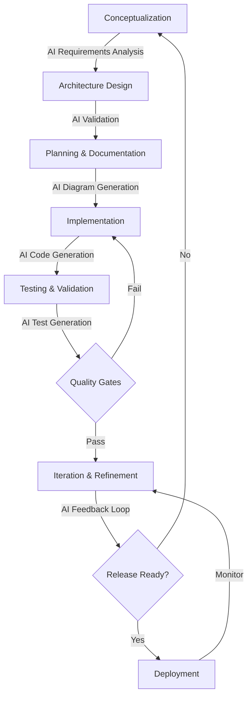
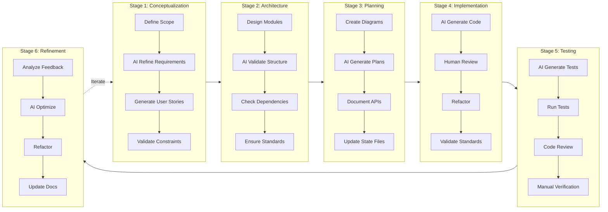
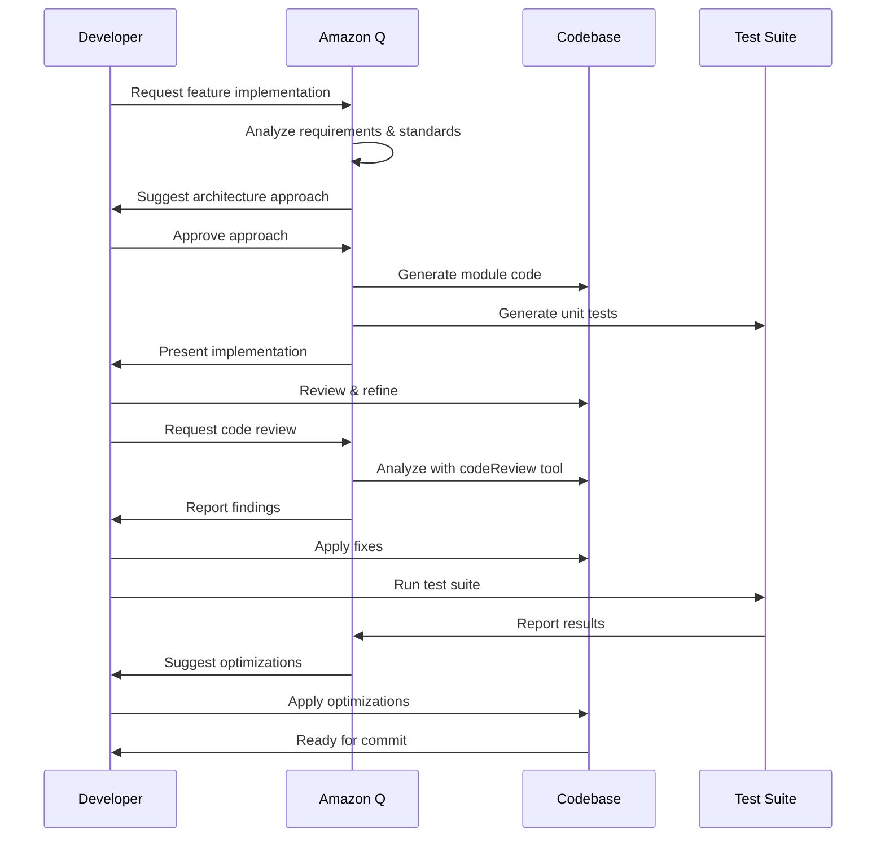
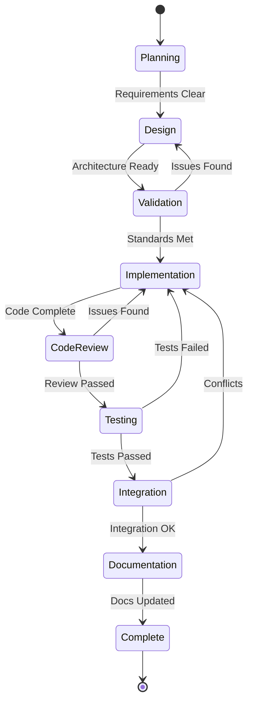
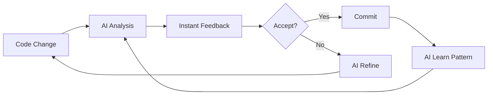
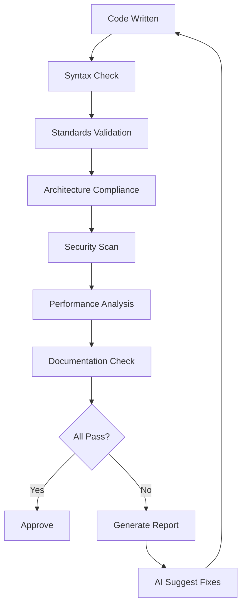
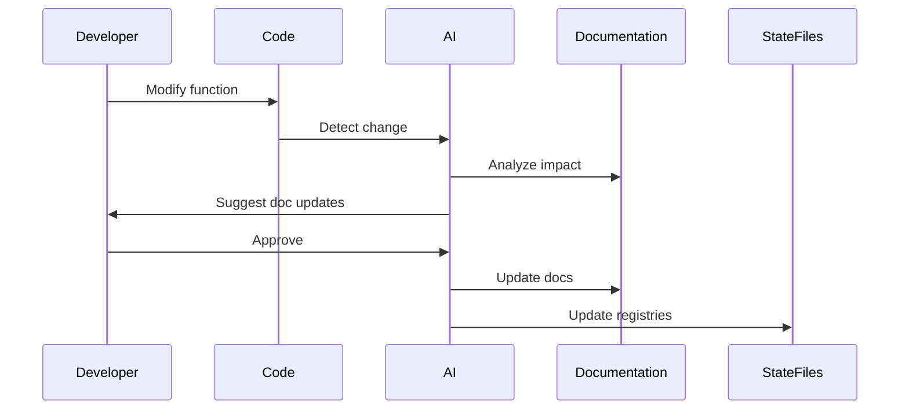

# AI-Paired Software Development Lifecycle
## Pair Programming with Amazon Q in VS Code

---

## Refactored Development Stages

### Stage 1: Conceptualization & Requirements
**AI Role:** Requirements analysis, feature suggestions, constraint validation
- Define app functionality and scope
- AI-assisted requirement refinement
- Generate user stories and acceptance criteria
- Validate against project standards

### Stage 2: Architecture Design
**AI Role:** Architecture validation, pattern suggestions, dependency analysis
- Design modular engine structure
- AI validates against architectural principles
- Generate dependency graphs
- Ensure compliance with file size limits (≤500 lines)

### Stage 3: Planning & Documentation
**AI Role:** Diagram generation, plan refinement, documentation creation
- Create architecture diagrams (Mermaid/PlantUML)
- AI generates development roadmaps
- Document module interfaces
- Update state files (project_registry.json, dependencies_map.json)

### Stage 4: Implementation
**AI Role:** Code generation, refactoring, real-time validation
- Iterative development with AI pair programming
- AI generates boilerplate and module scaffolding
- Real-time code review and suggestions
- Continuous validation against standards

### Stage 5: Testing & Validation
**AI Role:** Test generation, bug detection, coverage analysis
- AI generates unit and integration tests
- Automated code review with codeReview tool
- Manual verification of critical paths
- Performance and security validation

### Stage 6: Iteration & Refinement
**AI Role:** Feedback analysis, optimization suggestions, refactoring
- AI analyzes test results and user feedback
- Suggests optimizations and improvements
- Refactors code for maintainability
- Updates documentation and state files

---

## SDLC Diagrams

### Overall AI-Paired Development Flow



### Detailed Stage Breakdown



### AI Feedback Loop Integration



### Module Development Workflow



---

## Comparison with Modern Methodologies

### Agile Development

| Aspect | Traditional Agile | AI-Paired Agile |
|--------|------------------|-----------------|
| **Sprint Planning** | Manual estimation | AI-assisted estimation with historical data |
| **Code Review** | Peer review (async) | Real-time AI review + peer review |
| **Testing** | Manual test writing | AI generates tests, human validates |
| **Refactoring** | Periodic, manual | Continuous AI suggestions |
| **Documentation** | Often outdated | AI auto-updates from code changes |
| **Velocity** | Moderate | 2-3x faster with AI assistance |

**Benefits:**
- Faster iteration cycles
- Consistent code quality
- Reduced technical debt
- Better documentation coverage

### DevOps Pipeline

| Stage | Traditional DevOps | AI-Enhanced DevOps |
|-------|-------------------|-------------------|
| **CI/CD** | Automated builds/tests | AI predicts build failures, suggests fixes |
| **Monitoring** | Alert-based | AI anomaly detection, proactive fixes |
| **Deployment** | Manual approval gates | AI risk assessment, automated rollback |
| **Infrastructure** | IaC templates | AI optimizes resource allocation |
| **Security** | Periodic scans | Continuous AI security analysis |

**Benefits:**
- Proactive issue detection
- Reduced deployment failures
- Optimized resource usage
- Enhanced security posture

### Test-Driven Development (TDD)

| Phase | Traditional TDD | AI-Paired TDD |
|-------|----------------|---------------|
| **Write Test** | Manual test creation | AI generates test cases from requirements |
| **Run Test** | Manual execution | Automated with AI coverage analysis |
| **Write Code** | Manual implementation | AI suggests implementation patterns |
| **Refactor** | Manual optimization | AI identifies refactoring opportunities |
| **Coverage** | Manual gap analysis | AI ensures comprehensive coverage |

**Benefits:**
- Higher test coverage (80%+ vs 60%)
- Faster test creation
- Better edge case detection
- Continuous refactoring

---

## Suggested Improvements

### 1. Enhanced Feedback Loops



**Implementation:**
- Real-time validation as you type
- AI learns from accepted/rejected suggestions
- Context-aware recommendations based on project history

### 2. Multi-Stage AI Validation



**Benefits:**
- Catches issues earlier
- Reduces manual review time
- Ensures consistent quality

### 3. Intelligent Test Generation

**Current:** Manual test writing
**Improved:** AI generates tests from:
- Function signatures
- Code comments
- Usage patterns
- Edge case analysis

**Example:**
```javascript
// AI analyzes this function
function createBlock(type, content, parent) {
  // Implementation
}

// AI generates:
// - Unit tests for valid inputs
// - Edge cases (null, undefined, invalid types)
// - Integration tests with parent blocks
// - Performance tests for large content
```

### 4. Automated Documentation Sync



**Benefits:**
- Always up-to-date documentation
- Reduced manual maintenance
- Consistent documentation style

### 5. Predictive Development

**AI analyzes patterns to predict:**
- Likely bugs based on code structure
- Performance bottlenecks before they occur
- Security vulnerabilities in design phase
- Module dependencies that may cause conflicts

### 6. Context-Aware Code Generation

**Improvements:**
- AI remembers project standards (≤500 lines/file)
- Suggests code matching existing patterns
- Auto-applies naming conventions
- Ensures CRDT-first architecture compliance

---

## Implementation Roadmap

### Phase 1: Foundation (Current)
- ✅ Project standards defined
- ✅ Architecture documented
- ✅ AI pair programming active
- 🔄 State file automation

### Phase 2: Enhanced Validation
- AI-driven code review integration
- Automated standards enforcement
- Real-time feedback loops
- Multi-stage validation pipeline

### Phase 3: Intelligent Automation
- Predictive bug detection
- Auto-generated test suites
- Documentation synchronization
- Performance optimization suggestions

### Phase 4: Learning & Optimization
- Pattern learning from project history
- Custom AI models for project-specific needs
- Automated refactoring suggestions
- Continuous improvement loops

---

## Best Practices for AI-Paired Development

### 1. Clear Communication
- Provide context in prompts
- Reference specific files with `@file`
- Use `@workspace` for broader context
- Leverage saved prompts with `@prompt`

### 2. Iterative Refinement
- Start with high-level design
- Refine with AI feedback
- Validate against standards
- Iterate until optimal

### 3. Trust but Verify
- AI generates, human validates
- Critical paths need manual review
- Security-sensitive code requires extra scrutiny
- Performance claims need benchmarking

### 4. Maintain Standards
- AI enforces file size limits
- Validates naming conventions
- Checks architectural compliance
- Updates state files automatically

### 5. Continuous Learning
- Review AI suggestions critically
- Provide feedback on quality
- Update project rules based on learnings
- Share successful patterns

---

## Metrics for Success

### Code Quality
- **File Size Compliance:** 100% files ≤500 lines
- **Function Size:** 100% functions ≤50 lines
- **Test Coverage:** ≥80%
- **Code Review Issues:** <5 per 1000 lines

### Development Velocity
- **Feature Completion:** 2-3x faster with AI
- **Bug Fix Time:** 50% reduction
- **Documentation Time:** 70% reduction
- **Refactoring Effort:** 60% reduction

### Collaboration
- **Code Review Turnaround:** <2 hours
- **Knowledge Sharing:** Automated via docs
- **Onboarding Time:** 50% faster
- **Context Switching:** Minimal with AI memory

---

## Conclusion

AI-paired development with Amazon Q transforms the SDLC by:
- **Accelerating** development through intelligent code generation
- **Improving** quality with continuous validation
- **Reducing** technical debt through proactive refactoring
- **Enhancing** collaboration with automated documentation
- **Enabling** focus on architecture and design over boilerplate

The key is maintaining human oversight while leveraging AI for automation, validation, and optimization.
