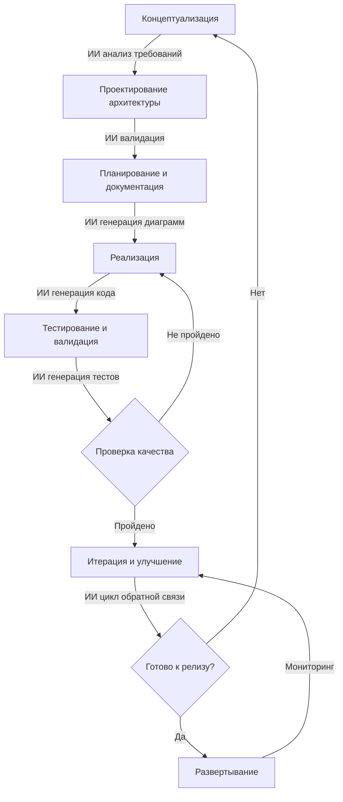
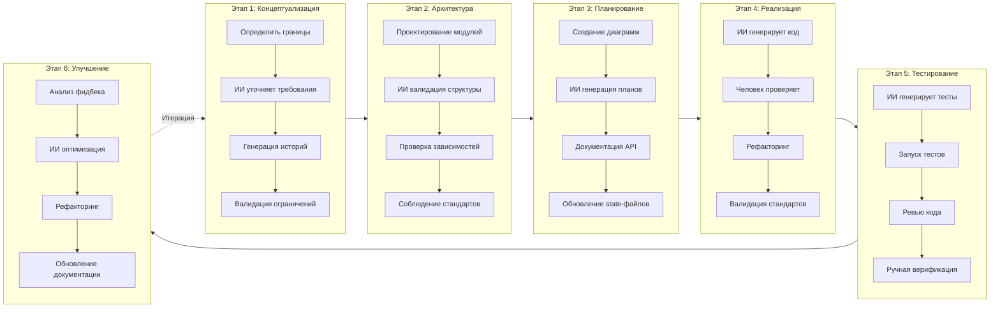
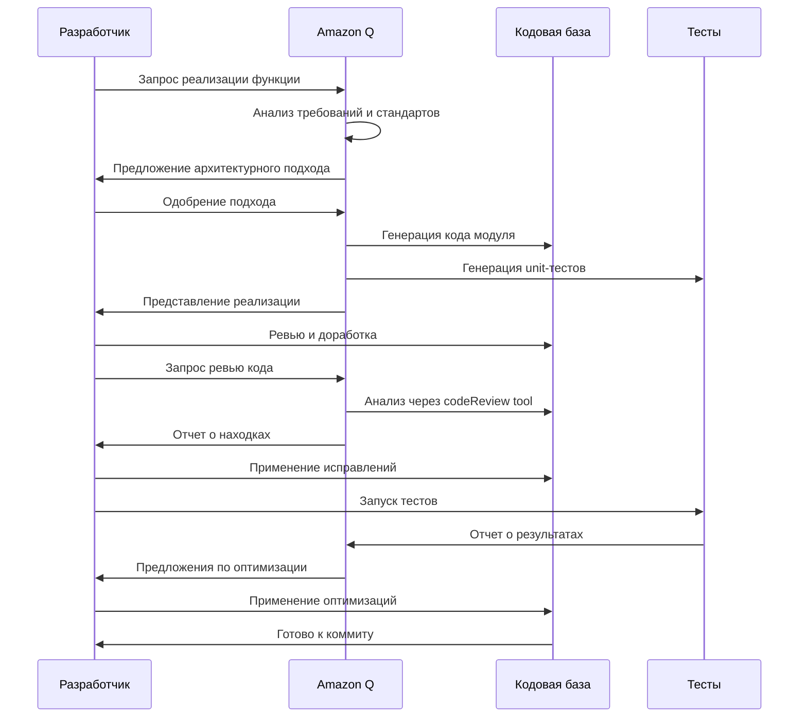
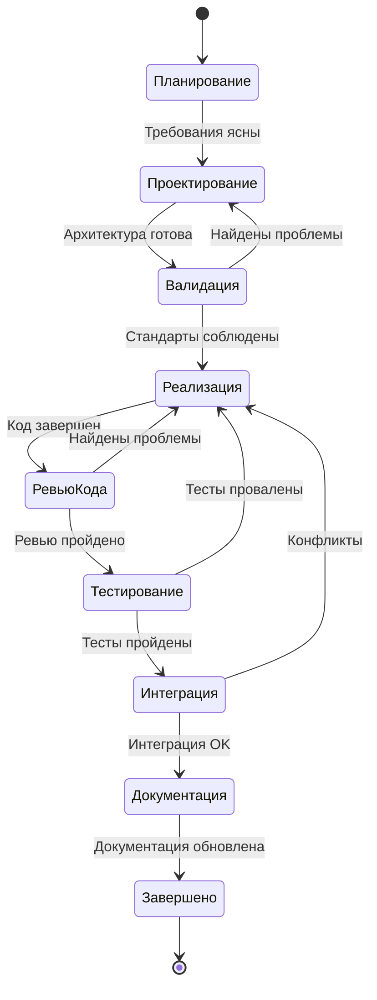
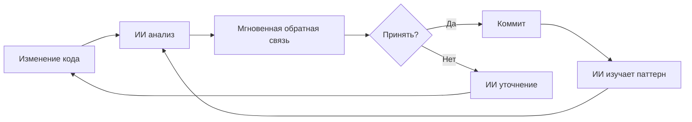
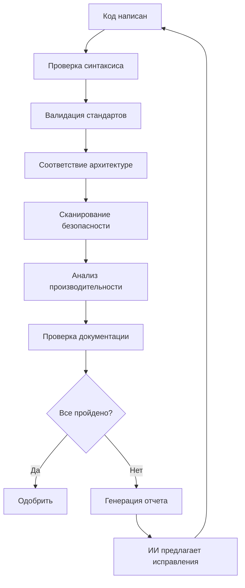
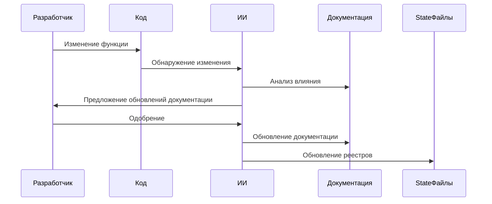

# Жизненный цикл разработки ПО с ИИ
## Парное программирование с Amazon Q в VS Code

---

## Переработанные этапы разработки

### Этап 1: Концептуализация и требования
**Роль ИИ:** Анализ требований, предложение функций, валидация ограничений
- Определение функциональности и границ приложения
- ИИ-рефайнинг требований
- Генерация пользовательских историй и критериев приемки
- Валидация против стандартов проекта

### Этап 2: Проектирование архитектуры
**Роль ИИ:** Валидация архитектуры, предложение паттернов, анализ зависимостей
- Проектирование модульной структуры
- ИИ валидирует архитектурные принципы
- Генерация графов зависимостей
- Соблюдение лимитов размера файлов (≤500 строк)

### Этап 3: Планирование и документация
**Роль ИИ:** Генерация диаграмм, уточнение планов, создание документации
- Создание архитектурных диаграмм (Mermaid/PlantUML)
- ИИ генерирует дорожные карты разработки
- Документирование интерфейсов модулей
- Обновление state-файлов (project_registry.json, dependencies_map.json)

### Этап 4: Реализация
**Роль ИИ:** Генерация кода, рефакторинг, валидация в реальном времени
- Итеративная разработка с парным программированием ИИ
- ИИ генерирует шаблонный код и скаффолдинг модулей
- Ревью кода и предложения в реальном времени
- Непрерывная валидация против стандартов

### Этап 5: Тестирование и валидация
**Роль ИИ:** Генерация тестов, обнаружение багов, анализ покрытия
- ИИ генерирует unit и интеграционные тесты
- Автоматизированное ревью кода через codeReview tool
- Ручная верификация критических путей
- Валидация производительности и безопасности

### Этап 6: Итерация и улучшение
**Роль ИИ:** Анализ обратной связи, предложения по оптимизации, рефакторинг
- ИИ анализирует результаты тестов и фидбек пользователей
- Предлагает оптимизации и улучшения
- Рефакторит код для поддерживаемости
- Обновляет документацию и state-файлы

---

## Диаграммы SDLC

### Общий поток разработки с ИИ



### Детализация этапов



### Интеграция цикла обратной связи ИИ



### Workflow разработки модуля



---

## Сравнение с современными методологиями

### Agile разработка

| Аспект | Традиционный Agile | Agile с ИИ |
|--------|-------------------|------------|
| **Планирование спринта** | Ручная оценка | ИИ-оценка на основе истории |
| **Ревью кода** | Peer review (асинхронно) | Ревью ИИ в реальном времени + peer review |
| **Тестирование** | Ручное написание тестов | ИИ генерирует тесты, человек валидирует |
| **Рефакторинг** | Периодический, ручной | Непрерывные предложения ИИ |
| **Документация** | Часто устаревает | ИИ автообновление из изменений кода |
| **Скорость** | Умеренная | В 2-3 раза быстрее с ИИ |

**Преимущества:**
- Более быстрые циклы итераций
- Стабильное качество кода
- Снижение технического долга
- Лучшее покрытие документацией

### DevOps Pipeline

| Этап | Традиционный DevOps | DevOps с ИИ |
|------|---------------------|-------------|
| **CI/CD** | Автоматизированные сборки/тесты | ИИ предсказывает сбои сборки, предлагает исправления |
| **Мониторинг** | На основе алертов | ИИ обнаружение аномалий, проактивные исправления |
| **Развертывание** | Ручные гейты одобрения | ИИ оценка рисков, автоматический откат |
| **Инфраструктура** | IaC шаблоны | ИИ оптимизирует распределение ресурсов |
| **Безопасность** | Периодические сканирования | Непрерывный ИИ анализ безопасности |

**Преимущества:**
- Проактивное обнаружение проблем
- Снижение сбоев развертывания
- Оптимизированное использование ресурсов
- Улучшенная безопасность

### Test-Driven Development (TDD)

| Фаза | Традиционный TDD | TDD с ИИ |
|------|------------------|----------|
| **Написание теста** | Ручное создание тестов | ИИ генерирует тест-кейсы из требований |
| **Запуск теста** | Ручное выполнение | Автоматизация с ИИ анализом покрытия |
| **Написание кода** | Ручная реализация | ИИ предлагает паттерны реализации |
| **Рефакторинг** | Ручная оптимизация | ИИ выявляет возможности рефакторинга |
| **Покрытие** | Ручной анализ пробелов | ИИ обеспечивает полное покрытие |

**Преимущества:**
- Более высокое покрытие тестами (80%+ vs 60%)
- Более быстрое создание тестов
- Лучшее обнаружение граничных случаев
- Непрерывный рефакторинг

---

## Предлагаемые улучшения

### 1. Усиленные циклы обратной связи



**Реализация:**
- Валидация в реальном времени при наборе
- ИИ учится на принятых/отклоненных предложениях
- Контекстно-зависимые рекомендации на основе истории проекта

### 2. Многоэтапная ИИ валидация



**Преимущества:**
- Раннее обнаружение проблем
- Сокращение времени ручного ревью
- Стабильное качество

### 3. Интеллектуальная генерация тестов

**Текущее:** Ручное написание тестов
**Улучшенное:** ИИ генерирует тесты из:
- Сигнатур функций
- Комментариев в коде
- Паттернов использования
- Анализа граничных случаев

**Пример:**
```javascript
// ИИ анализирует эту функцию
function createBlock(type, content, parent) {
  // Реализация
}

// ИИ генерирует:
// - Unit-тесты для валидных входов
// - Граничные случаи (null, undefined, невалидные типы)
// - Интеграционные тесты с родительскими блоками
// - Тесты производительности для большого контента
```

### 4. Автоматическая синхронизация документации



**Преимущества:**
- Всегда актуальная документация
- Снижение ручного обслуживания
- Единообразный стиль документации

### 5. Предиктивная разработка

**ИИ анализирует паттерны для предсказания:**
- Вероятных багов на основе структуры кода
- Узких мест производительности до их возникновения
- Уязвимостей безопасности на этапе проектирования
- Зависимостей модулей, которые могут вызвать конфликты

### 6. Контекстно-зависимая генерация кода

**Улучшения:**
- ИИ помнит стандарты проекта (≤500 строк/файл)
- Предлагает код, соответствующий существующим паттернам
- Автоприменение соглашений об именовании
- Обеспечение соответствия CRDT-first архитектуре

---

## Дорожная карта реализации

### Фаза 1: Фундамент (Текущая)
- ✅ Стандарты проекта определены
- ✅ Архитектура задокументирована
- ✅ Парное программирование с ИИ активно
- 🔄 Автоматизация state-файлов

### Фаза 2: Усиленная валидация
- Интеграция ИИ-ревью кода
- Автоматизированное соблюдение стандартов
- Циклы обратной связи в реальном времени
- Многоэтапный конвейер валидации

### Фаза 3: Интеллектуальная автоматизация
- Предиктивное обнаружение багов
- Автогенерация тестовых наборов
- Синхронизация документации
- Предложения по оптимизации производительности

### Фаза 4: Обучение и оптимизация
- Изучение паттернов из истории проекта
- Кастомные ИИ модели для специфичных нужд проекта
- Автоматизированные предложения по рефакторингу
- Циклы непрерывного улучшения

---

## Лучшие практики разработки с ИИ

### 1. Четкая коммуникация
- Предоставляйте контекст в промптах
- Ссылайтесь на конкретные файлы через `@file`
- Используйте `@workspace` для широкого контекста
- Используйте сохраненные промпты через `@prompt`

### 2. Итеративное уточнение
- Начинайте с высокоуровневого дизайна
- Уточняйте с обратной связью ИИ
- Валидируйте против стандартов
- Итерируйте до оптимального результата

### 3. Доверяй, но проверяй
- ИИ генерирует, человек валидирует
- Критические пути требуют ручного ревью
- Код, чувствительный к безопасности, требует дополнительной проверки
- Утверждения о производительности требуют бенчмаркинга

### 4. Поддержание стандартов
- ИИ соблюдает лимиты размера файлов
- Валидирует соглашения об именовании
- Проверяет соответствие архитектуре
- Автоматически обновляет state-файлы

### 5. Непрерывное обучение
- Критически оценивайте предложения ИИ
- Предоставляйте обратную связь о качестве
- Обновляйте правила проекта на основе опыта
- Делитесь успешными паттернами

---

## Метрики успеха

### Качество кода
- **Соответствие размера файлов:** 100% файлов ≤500 строк
- **Размер функций:** 100% функций ≤50 строк
- **Покрытие тестами:** ≥80%
- **Проблемы ревью кода:** <5 на 1000 строк

### Скорость разработки
- **Завершение функций:** В 2-3 раза быстрее с ИИ
- **Время исправления багов:** Снижение на 50%
- **Время документирования:** Снижение на 70%
- **Усилия на рефакторинг:** Снижение на 60%

### Коллаборация
- **Время ревью кода:** <2 часов
- **Обмен знаниями:** Автоматизирован через документацию
- **Время онбординга:** На 50% быстрее
- **Переключение контекста:** Минимально с памятью ИИ

---

## Заключение

Разработка с ИИ-парой через Amazon Q трансформирует SDLC:
- **Ускоряет** разработку через интеллектуальную генерацию кода
- **Улучшает** качество через непрерывную валидацию
- **Снижает** технический долг через проактивный рефакторинг
- **Усиливает** коллаборацию через автоматизированную документацию
- **Позволяет** фокусироваться на архитектуре и дизайне вместо шаблонного кода

Ключ — поддержание человеческого надзора при использовании ИИ для автоматизации, валидации и оптимизации.
