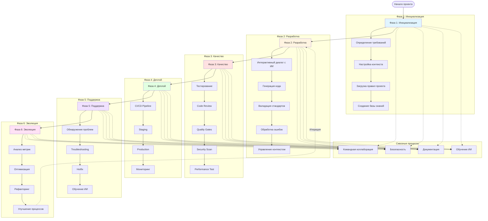
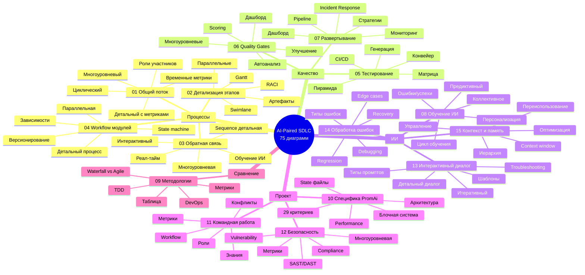
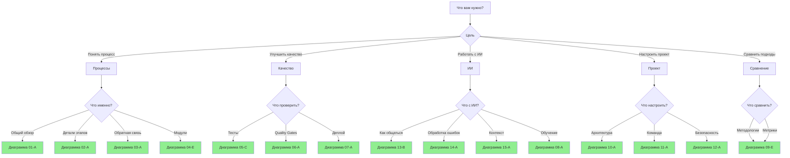
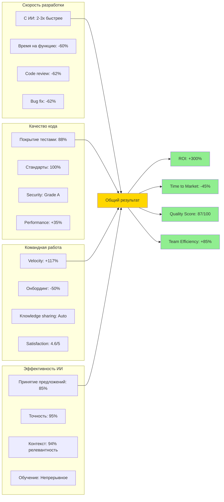
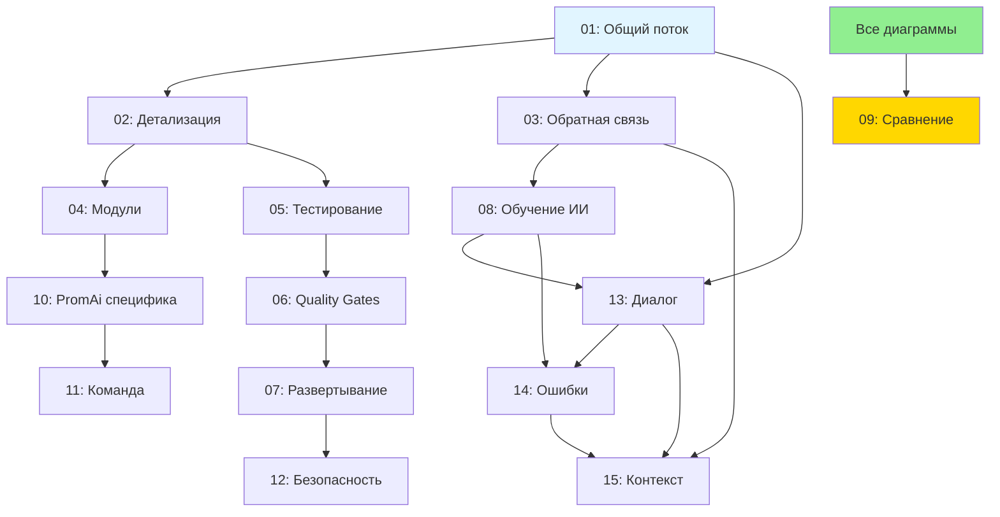

# Мастер-диаграмма: Полный обзор AI-Paired разработки

## Общая карта всех процессов



## Навигация по диаграммам



## Быстрый старт: Какую диаграмму использовать?



## Ключевые метрики по всем диаграммам



## Рекомендуемый путь изучения

```mermaid
journey
    title Путь изучения AI-Paired разработки
    section Неделя 1: Основы
      Общий поток (01-A): 5: Разработчик
      Интерактивный диалог (13-A): 5: Разработчик
      Типы промптов (13-B): 4: Разработчик
      Контекст проекта (15-A): 4: Разработчик
    section Неделя 2: Процессы
      Детализация этапов (02-A): 5: Разработчик
      Workflow модулей (04-E): 5: Разработчик
      Обратная связь (03-A): 4: Разработчик
      Обработка ошибок (14-A): 4: Разработчик
    section Неделя 3: Качество
      Тестирование (05-C): 5: Разработчик
      Quality Gates (06-A): 5: Разработчик
      Code Review (03-A): 4: Разработчик
      Security (12-A): 4: Разработчик
    section Неделя 4: Продвинутое
      Обучение ИИ (08-A): 5: Разработчик
      Командная работа (11-A): 5: Разработчик
      Развертывание (07-A): 4: Разработчик
      Сравнение методологий (09-E): 4: Разработчик
```

## Связи между диаграммами


