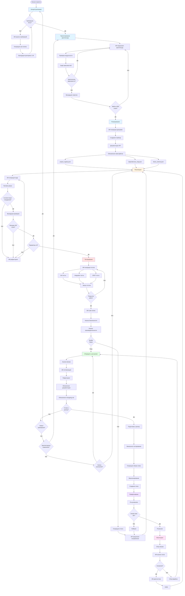
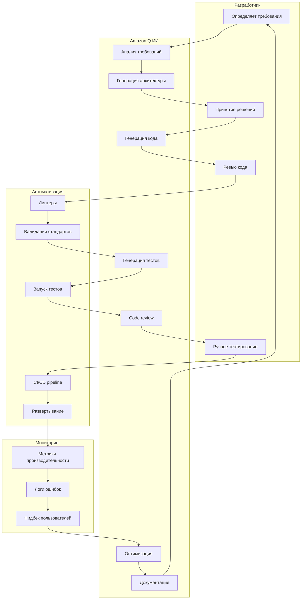
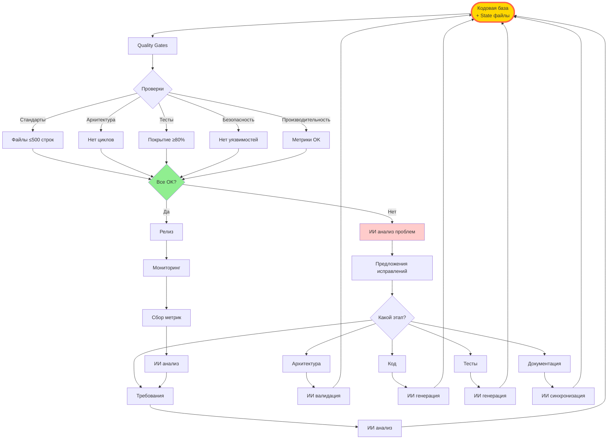
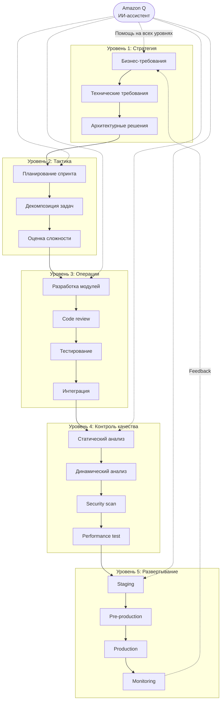

# Диаграмма 1: Расширенный общий поток разработки

## Вариант A: Детальный поток с метриками

## Вариант B: Поток с временными метриками

```mermaid
graph LR
    subgraph "Фаза 1: Планирование (1-2 дня)"
        A1[Концептуализация<br/>4-8 часов] --> A2[Архитектура<br/>4-6 часов]
        A2 --> A3[Документация<br/>2-4 часа]
    end
    
    subgraph "Фаза 2: Разработка (5-10 дней)"
        B1[Модуль Core<br/>2-3 дня] --> B2[Модуль CRDT<br/>2-3 дня]
        B2 --> B3[Модуль Storage<br/>1-2 дня]
        B3 --> B4[Модуль UI<br/>2-3 дня]
        B4 --> B5[Модуль Plugin<br/>1-2 дня]
    end
    
    subgraph "Фаза 3: Тестирование (2-3 дня)"
        C1[Unit тесты<br/>1 день] --> C2[Integration тесты<br/>1 день]
        C2 --> C3[E2E тесты<br/>0.5 дня]
        C3 --> C4[Performance тесты<br/>0.5 дня]
    end
    
    subgraph "Фаза 4: Релиз (1 день)"
        D1[Финальное ревью<br/>2 часа] --> D2[Подготовка релиза<br/>2 часа]
        D2 --> D3[Развертывание<br/>2 часа]
        D3 --> D4[Мониторинг<br/>2 часа]
    end
    
    A3 --> B1
    B5 --> C1
    C4 --> D1
    
    D4 -.Итерация.-> A1
```

## Вариант C: Поток с ролями участников

## Вариант D: Циклический поток с обратной связью

## Вариант E: Многоуровневый поток

