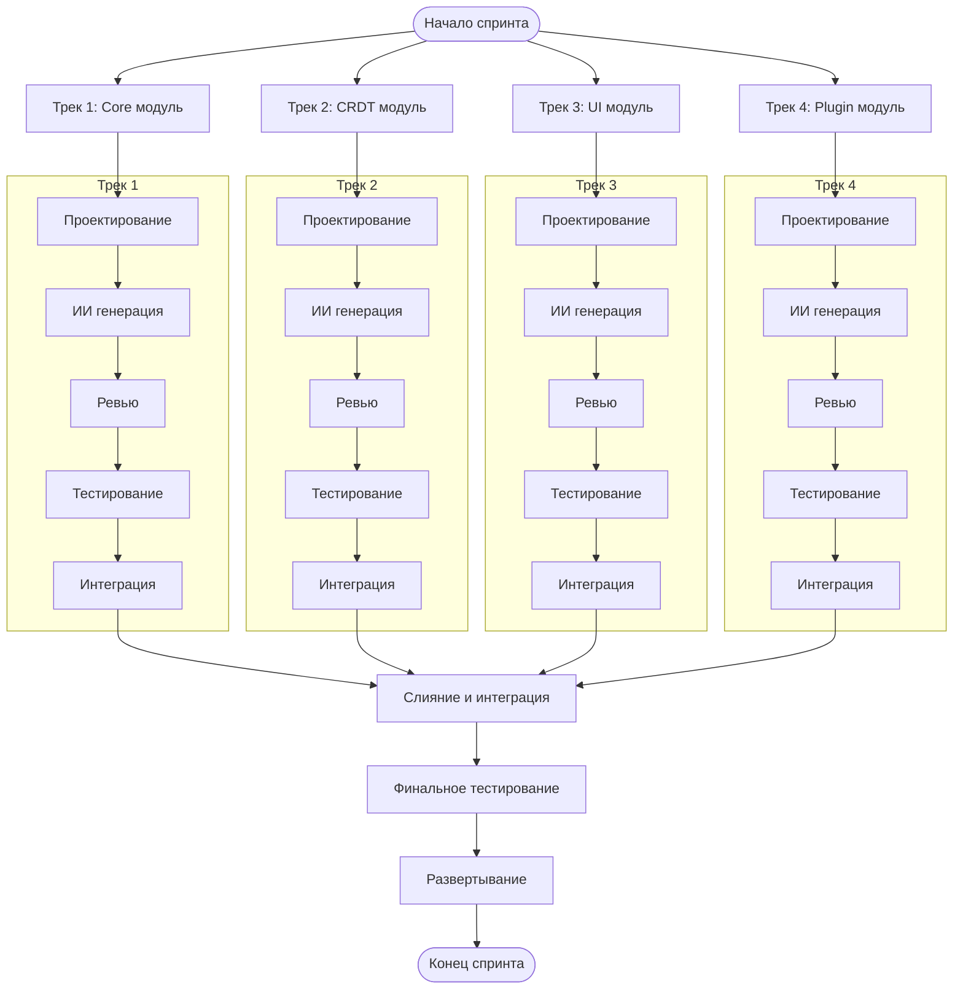
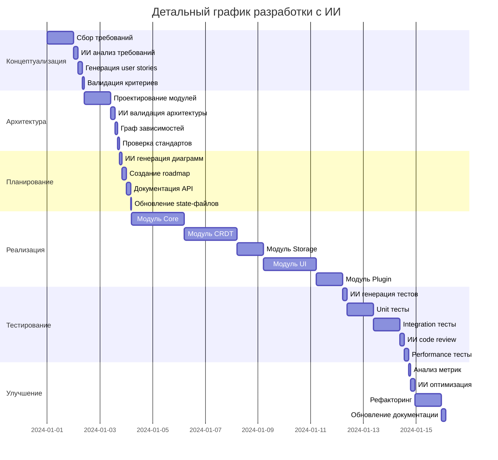
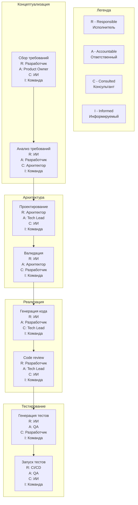

# Диаграмма 2: Детализация этапов разработки

## Вариант A: Swimlane диаграмма по этапам

```mermaid
graph TB
    subgraph "ЭТАП 1: Концептуализация"
        A1[Сбор требований] --> A2[ИИ анализ]
        A2 --> A3[Генерация user stories]
        A3 --> A4[Приоритизация]
        A4 --> A5[Валидация критериев 1-29]
        A5 --> A6[Создание backlog]
        A6 --> A7{Требования<br/>полные?}
        A7 -->|Нет| A1
        A7 -->|Да| A8[✓ Этап завершен]
    end
    
    subgraph "ЭТАП 2: Архитектура"
        B1[Анализ требований] --> B2[ИИ предлагает паттерны]
        B2 --> B3[Выбор архитектуры]
        B3 --> B4[Проектирование модулей]
        B4 --> B5[Граф зависимостей]
        B5 --> B6[Валидация циклов]
        B6 --> B7{Циклы<br/>найдены?}
        B7 -->|Да| B4
        B7 -->|Нет| B8[Проверка лимитов]
        B8 --> B9{Соответствует<br/>стандартам?}
        B9 -->|Нет| B4
        B9 -->|Да| B10[✓ Этап завершен]
    end
    
    subgraph "ЭТАП 3: Планирование"
        C1[Декомпозиция модулей] --> C2[ИИ генерация диаграмм]
        C2 --> C3[Создание roadmap]
        C3 --> C4[Оценка сложности]
        C4 --> C5[Планирование спринтов]
        C5 --> C6[Документация API]
        C6 --> C7[Обновление state-файлов]
        C7 --> C8[project_registry.json]
        C7 --> C9[dependencies_map.json]
        C7 --> C10[block_schema.json]
        C8 --> C11[✓ Этап завершен]
        C9 --> C11
        C10 --> C11
    end
    
    subgraph "ЭТАП 4: Реализация"
        D1[Выбор модуля] --> D2[ИИ генерация кода]
        D2 --> D3[Человек ревью]
        D3 --> D4{Качество<br/>OK?}
        D4 -->|Нет| D5[ИИ рефакторинг]
        D5 --> D2
        D4 -->|Да| D6[Валидация стандартов]
        D6 --> D7{Файл ≤500<br/>строк?}
        D7 -->|Нет| D5
        D7 -->|Да| D8{Функции ≤50<br/>строк?}
        D8 -->|Нет| D5
        D8 -->|Да| D9{Параметры ≤3?}
        D9 -->|Нет| D5
        D9 -->|Да| D10[Коммит]
        D10 --> D11{Все модули<br/>готовы?}
        D11 -->|Нет| D1
        D11 -->|Да| D12[✓ Этап завершен]
    end
    
    subgraph "ЭТАП 5: Тестирование"
        E1[ИИ генерация тестов] --> E2[Unit тесты]
        E1 --> E3[Integration тесты]
        E1 --> E4[CRDT тесты]
        E1 --> E5[Plugin тесты]
        E2 --> E6[Запуск тестов]
        E3 --> E6
        E4 --> E6
        E5 --> E6
        E6 --> E7{Покрытие<br/>≥80%?}
        E7 -->|Нет| E1
        E7 -->|Да| E8[ИИ code review]
        E8 --> E9[Security scan]
        E9 --> E10[Performance test]
        E10 --> E11{Все проверки<br/>пройдены?}
        E11 -->|Нет| E12[Анализ проблем]
        E12 --> E13{Тип<br/>проблемы?}
        E13 -->|Код| D1
        E13 -->|Тесты| E1
        E11 -->|Да| E14[✓ Этап завершен]
    end
    
    subgraph "ЭТАП 6: Улучшение"
        F1[Сбор метрик] --> F2[ИИ анализ]
        F2 --> F3[Выявление узких мест]
        F3 --> F4[Предложения оптимизации]
        F4 --> F5[Рефакторинг]
        F5 --> F6[Обновление документации]
        F6 --> F7[Обновление changelog]
        F7 --> F8{Готово к<br/>релизу?}
        F8 -->|Нет| F9{Что нужно?}
        F9 -->|Новые требования| A1
        F9 -->|Изменение архитектуры| B1
        F9 -->|Новый функционал| D1
        F9 -->|Улучшения| F1
        F8 -->|Да| F10[✓ Этап завершен]
    end
    
    A8 --> B1
    B10 --> C1
    C11 --> D1
    D12 --> E1
    E14 --> F1
```

## Вариант B: Детализация с артефактами

```mermaid
flowchart TD
    subgraph "Концептуализация"
        direction LR
        A1[Входы:<br/>- Идея<br/>- Бизнес-цели] --> A2[Процесс:<br/>- ИИ анализ<br/>- User stories<br/>- Критерии]
        A2 --> A3[Выходы:<br/>- Backlog<br/>- Требования<br/>- Критерии приемки]
    end
    
    subgraph "Архитектура"
        direction LR
        B1[Входы:<br/>- Требования<br/>- Ограничения] --> B2[Процесс:<br/>- Проектирование<br/>- Валидация<br/>- Граф зависимостей]
        B2 --> B3[Выходы:<br/>- Архитектура<br/>- Модули<br/>- Интерфейсы]
    end
    
    subgraph "Планирование"
        direction LR
        C1[Входы:<br/>- Архитектура<br/>- Модули] --> C2[Процесс:<br/>- Диаграммы<br/>- Roadmap<br/>- Документация]
        C2 --> C3[Выходы:<br/>- Диаграммы<br/>- План<br/>- State-файлы]
    end
    
    subgraph "Реализация"
        direction LR
        D1[Входы:<br/>- План<br/>- Спецификации] --> D2[Процесс:<br/>- ИИ генерация<br/>- Ревью<br/>- Валидация]
        D2 --> D3[Выходы:<br/>- Код<br/>- Коммиты<br/>- Модули]
    end
    
    subgraph "Тестирование"
        direction LR
        E1[Входы:<br/>- Код<br/>- Требования] --> E2[Процесс:<br/>- Генерация тестов<br/>- Запуск<br/>- Анализ]
        E2 --> E3[Выходы:<br/>- Тесты<br/>- Отчеты<br/>- Метрики]
    end
    
    subgraph "Улучшение"
        direction LR
        F1[Входы:<br/>- Метрики<br/>- Фидбек] --> F2[Процесс:<br/>- Анализ<br/>- Оптимизация<br/>- Рефакторинг]
        F2 --> F3[Выходы:<br/>- Улучшения<br/>- Документация<br/>- Changelog]
    end
    
    A3 --> B1
    B3 --> C1
    C3 --> D1
    D3 --> E1
    E3 --> F1
    F3 -.Итерация.-> A1
```

## Вариант C: Параллельные процессы

## Вариант D: Детализация с временными рамками

## Вариант E: Матрица ответственности (RACI)

