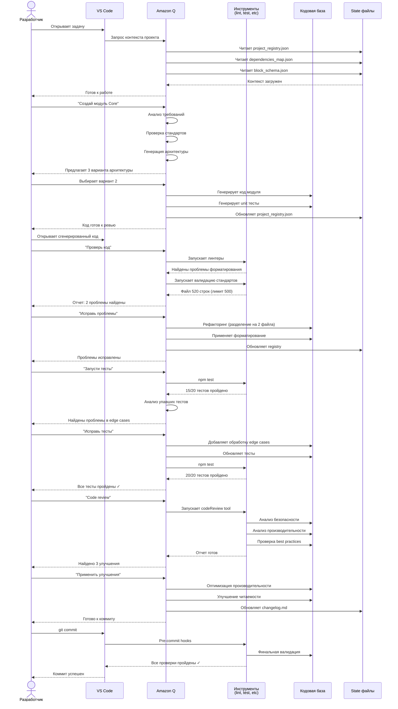
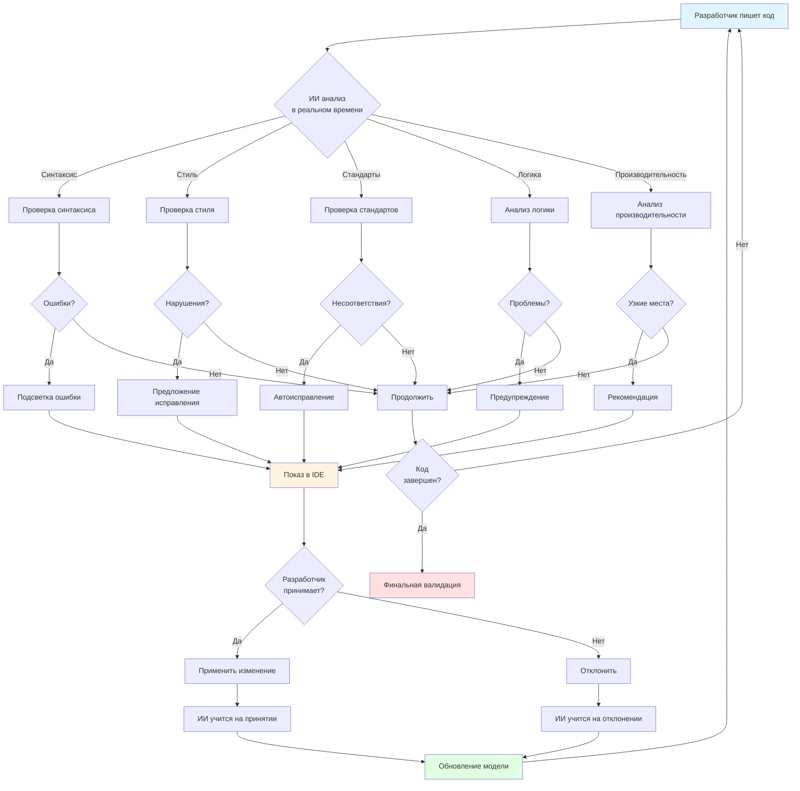
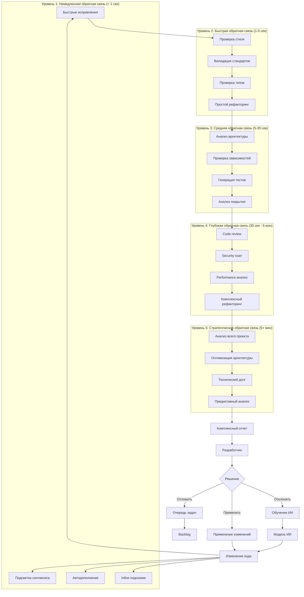
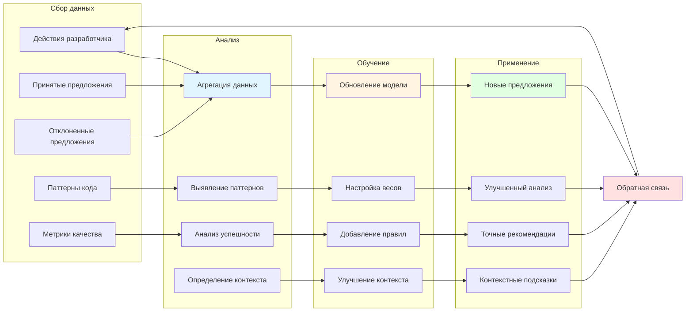
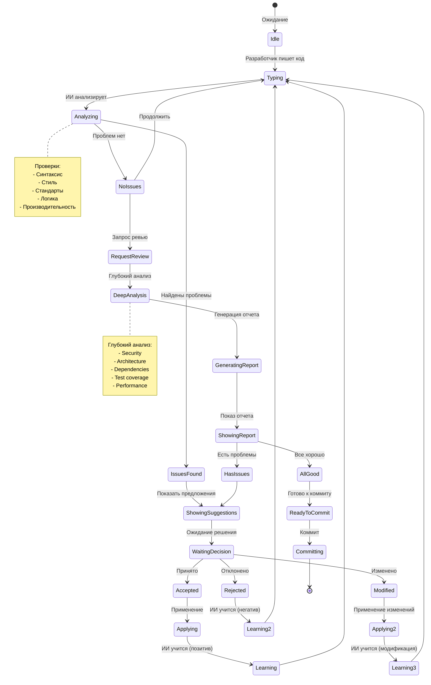

# Диаграмма 3: Циклы обратной связи с ИИ

## Вариант A: Детальная sequence диаграмма

## Вариант B: Цикл обратной связи в реальном времени

## Вариант C: Многоуровневая обратная связь

## Вариант D: Цикл обучения ИИ

## Вариант E: Интерактивный цикл разработки

