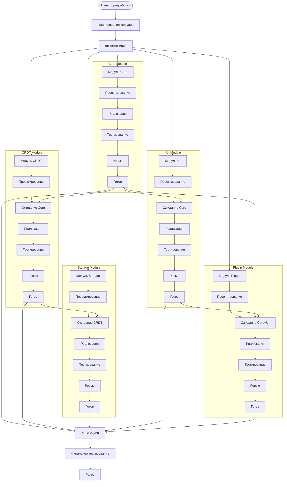
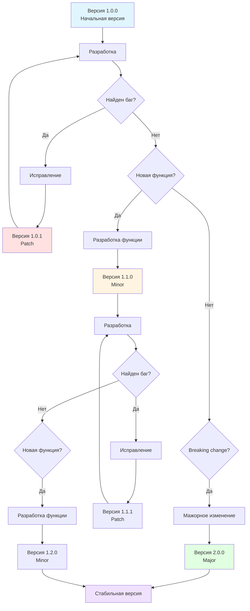
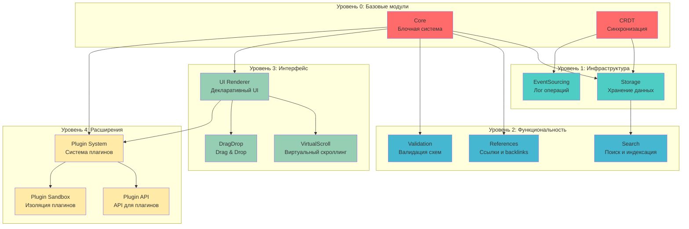
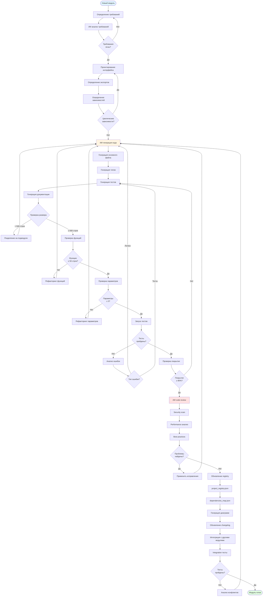

# Диаграмма 4: Workflow разработки модулей

## Вариант A: Детальный state machine модуля

```mermaid
stateDiagram-v2
    [*] --> Planned: Модуль запланирован
    
    Planned --> Designing: Начало проектирования
    Designing --> DesignReview: Дизайн готов
    
    DesignReview --> DesignApproved: Одобрено
    DesignReview --> Designing: Требуются изменения
    
    DesignApproved --> Implementing: Начало реализации
    
    state Implementing {
        [*] --> CodeGeneration
        CodeGeneration --> HumanReview
        HumanReview --> Validation
        
        Validation --> SizeCheck: Проверка размеров
        SizeCheck --> StyleCheck: Проверка стиля
        StyleCheck --> StandardsCheck: Проверка стандартов
        
        StandardsCheck --> ValidationPassed: Все OK
        StandardsCheck --> CodeGeneration: Нужны исправления
        
        ValidationPassed --> [*]
    }
    
    Implementing --> Testing: Код готов
    
    state Testing {
        [*] --> UnitTests
        UnitTests --> IntegrationTests
        IntegrationTests --> CRDTTests
        CRDTTests --> CoverageCheck
        
        CoverageCheck --> TestsPassed: Покрытие ≥80%
        CoverageCheck --> UnitTests: Недостаточно
        
        TestsPassed --> [*]
    }
    
    Testing --> CodeReview: Тесты пройдены
    
    state CodeReview {
        [*] --> StaticAnalysis
        StaticAnalysis --> SecurityScan
        SecurityScan --> PerformanceAnalysis
        PerformanceAnalysis --> BestPracticesCheck
        
        BestPracticesCheck --> ReviewPassed: Все OK
        BestPracticesCheck --> IssuesFound: Найдены проблемы
        
        IssuesFound --> [*]
        ReviewPassed --> [*]
    }
    
    CodeReview --> Integration: Ревью пройдено
    CodeReview --> Implementing: Нужны исправления
    
    state Integration {
        [*] --> DependencyCheck
        DependencyCheck --> ConflictResolution
        ConflictResolution --> IntegrationTests2
        IntegrationTests2 --> IntegrationPassed
        IntegrationPassed --> [*]
    }
    
    Integration --> Documentation: Интеграция успешна
    Integration --> Implementing: Конфликты
    
    state Documentation {
        [*] --> APIDocumentation
        APIDocumentation --> UpdateRegistry
        UpdateRegistry --> UpdateChangelog
        UpdateChangelog --> DocumentationComplete
        DocumentationComplete --> [*]
    }
    
    Documentation --> Completed: Документация готова
    Completed --> [*]
    
    note right of Implementing
        ИИ генерирует код
        Человек проверяет
        Автоматическая валидация
    end note
    
    note right of Testing
        ИИ генерирует тесты
        Автоматический запуск
        Анализ покрытия
    end note
    
    note right of CodeReview
        ИИ code review
        Security анализ
        Performance проверка
    end note
```

## Вариант B: Параллельная разработка модулей

## Вариант C: Жизненный цикл модуля с версионированием

## Вариант D: Workflow с зависимостями

## Вариант E: Детальный процесс создания модуля

