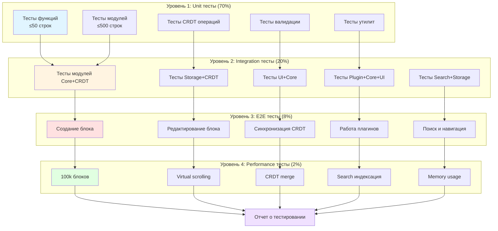
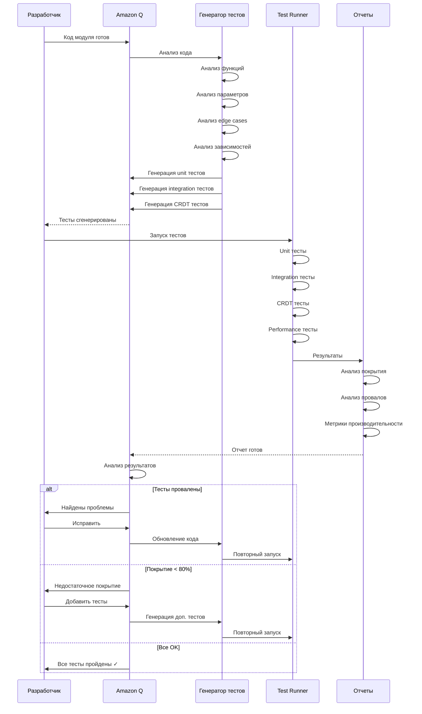
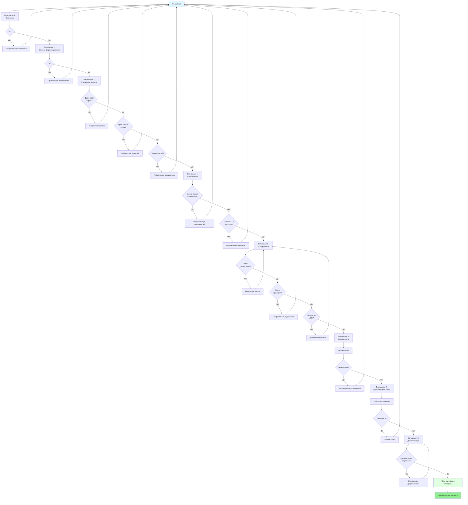

# Диаграмма 5: Тестирование и валидация

## Вариант A: Многоуровневая пирамида тестирования

## Вариант B: Процесс генерации и запуска тестов

## Вариант C: Валидационный конвейер

## Вариант D: Матрица тестового покрытия

```mermaid
graph TB
    subgraph "Модуль Core"
        Core_Unit[Unit: 95%]
        Core_Int[Integration: 85%]
        Core_E2E[E2E: 70%]
        Core_Perf[Performance: 100%]
    end
    
    subgraph "Модуль CRDT"
        CRDT_Unit[Unit: 90%]
        CRDT_Int[Integration: 80%]
        CRDT_E2E[E2E: 75%]
        CRDT_Perf[Performance: 95%]
    end
    
    subgraph "Модуль Storage"
        Storage_Unit[Unit: 88%]
        Storage_Int[Integration: 82%]
        Storage_E2E[E2E: 65%]
        Storage_Perf[Performance: 90%]
    end
    
    subgraph "Модуль UI"
        UI_Unit[Unit: 85%]
        UI_Int[Integration: 78%]
        UI_E2E[E2E: 80%]
        UI_Perf[Performance: 85%]
    end
    
    subgraph "Модуль Plugin"
        Plugin_Unit[Unit: 92%]
        Plugin_Int[Integration: 75%]
        Plugin_E2E[E2E: 70%]
        Plugin_Perf[Performance: 88%]
    end
    
    Core_Unit --> Total[Общее покрытие]
    Core_Int --> Total
    Core_E2E --> Total
    Core_Perf --> Total
    
    CRDT_Unit --> Total
    CRDT_Int --> Total
    CRDT_E2E --> Total
    CRDT_Perf --> Total
    
    Storage_Unit --> Total
    Storage_Int --> Total
    Storage_E2E --> Total
    Storage_Perf --> Total
    
    UI_Unit --> Total
    UI_Int --> Total
    UI_E2E --> Total
    UI_Perf --> Total
    
    Plugin_Unit --> Total
    Plugin_Int --> Total
    Plugin_E2E --> Total
    Plugin_Perf --> Total
    
    Total --> Result[Итого: 83%<br/>Цель: ≥80% ✓]
    
    style Result fill:#90ee90
```

## Вариант E: Автоматизированный CI/CD pipeline

```mermaid
graph LR
    subgraph "Commit"
        C1[git commit] --> C2[Pre-commit hooks]
        C2 --> C3[Lint]
        C2 --> C4[Format]
        C2 --> C5[Validate]
    end
    
    subgraph "Push"
        C3 --> P1[git push]
        C4 --> P1
        C5 --> P1
        P1 --> P2[CI Trigger]
    end
    
    subgraph "Build"
        P2 --> B1[Install deps]
        B1 --> B2[Build project]
        B2 --> B3{Build OK?}
        B3 -->|Нет| B4[Notify failure]
        B3 -->|Да| T1[Run tests]
    end
    
    subgraph "Test"
        T1 --> T2[Unit tests]
        T1 --> T3[Integration tests]
        T1 --> T4[E2E tests]
        T2 --> T5{All pass?}
        T3 --> T5
        T4 --> T5
        T5 -->|Нет| T6[Notify failure]
        T5 -->|Да| A1[Analysis]
    end
    
    subgraph "Analysis"
        A1 --> A2[Code coverage]
        A1 --> A3[Security scan]
        A1 --> A4[Performance test]
        A2 --> A5{All OK?}
        A3 --> A5
        A4 --> A5
        A5 -->|Нет| A6[Notify issues]
        A5 -->|Да| D1[Deploy]
    end
    
    subgraph "Deploy"
        D1 --> D2[Staging]
        D2 --> D3[Smoke tests]
        D3 --> D4{Tests OK?}
        D4 -->|Нет| D5[Rollback]
        D4 -->|Да| D6[Production]
        D6 --> D7[Monitor]
    end
    
    B4 --> End1[❌ Failed]
    T6 --> End1
    A6 --> End1
    D5 --> End1
    D7 --> End2[✓ Success]
    
    style End1 fill:#ffcccb
    style End2 fill:#90ee90
```

