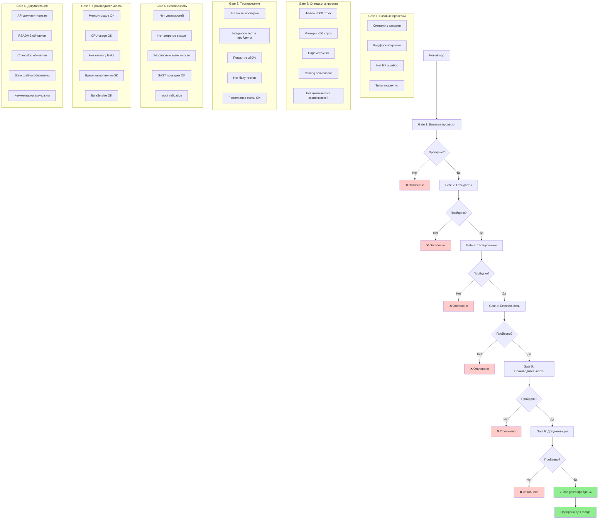
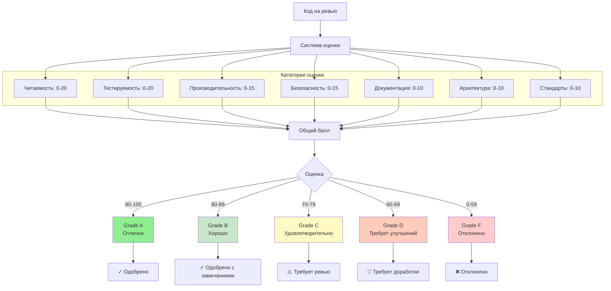
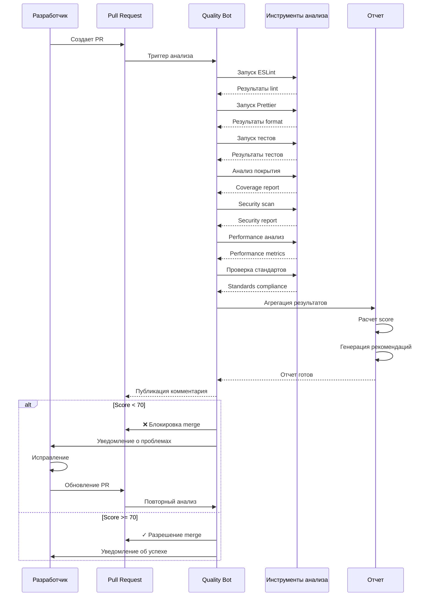
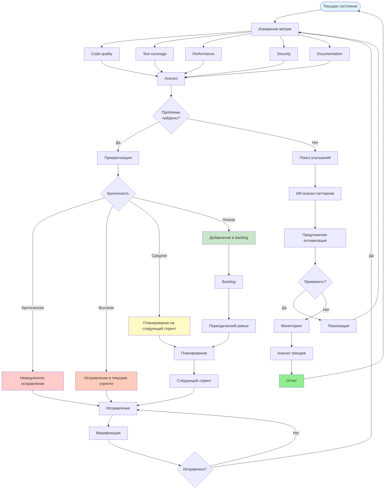

# Диаграмма 6: Quality Gates и контроль качества

## Вариант A: Многоуровневые Quality Gates

## Вариант B: Scoring система качества

## Вариант C: Автоматизированный анализ качества

## Вариант D: Дашборд метрик качества

```mermaid
graph TB
    subgraph "Метрики кода"
        M1[Lines of Code: 15,234]
        M2[Files: 87]
        M3[Functions: 423]
        M4[Avg File Size: 175 строк]
        M5[Avg Function Size: 23 строки]
    end
    
    subgraph "Метрики тестирования"
        T1[Test Coverage: 83%]
        T2[Unit Tests: 1,247]
        T3[Integration Tests: 156]
        T4[E2E Tests: 42]
        T5[Test Success Rate: 98.5%]
    end
    
    subgraph "Метрики качества"
        Q1[Code Quality Score: 87/100]
        Q2[Maintainability Index: A]
        Q3[Technical Debt: 2.3 дня]
        Q4[Code Smells: 12]
        Q5[Duplications: 1.2%]
    end
    
    subgraph "Метрики безопасности"
        S1[Vulnerabilities: 0]
        S2[Security Hotspots: 3]
        S3[Security Rating: A]
        S4[Secrets Detected: 0]
        S5[Dependencies OK: 98%]
    end
    
    subgraph "Метрики производительности"
        P1[Build Time: 45 сек]
        P2[Test Time: 2.3 мин]
        P3[Bundle Size: 234 KB]
        P4[Memory Usage: 145 MB]
        P5[Load Time: 1.2 сек]
    end
    
    M1 --> Health[Общее здоровье проекта]
    M2 --> Health
    T1 --> Health
    Q1 --> Health
    S1 --> Health
    P1 --> Health
    
    Health --> Score[Итоговый Score: 85/100]
    Score --> Status{Статус}
    
    Status -->|85-100| Excellent[🟢 Отличное состояние]
    Status -->|70-84| Good[🟡 Хорошее состояние]
    Status -->|50-69| Fair[🟠 Требует внимания]
    Status -->|0-49| Poor[🔴 Критическое состояние]
    
    style Excellent fill:#90ee90
    style Good fill:#fff9c4
    style Fair fill:#ffccbc
    style Poor fill:#ffcccb
```

## Вариант E: Процесс непрерывного улучшения качества

