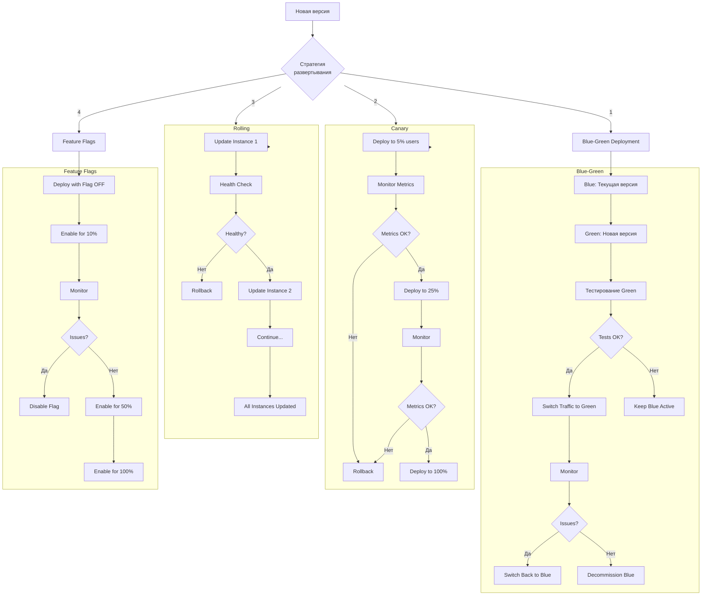
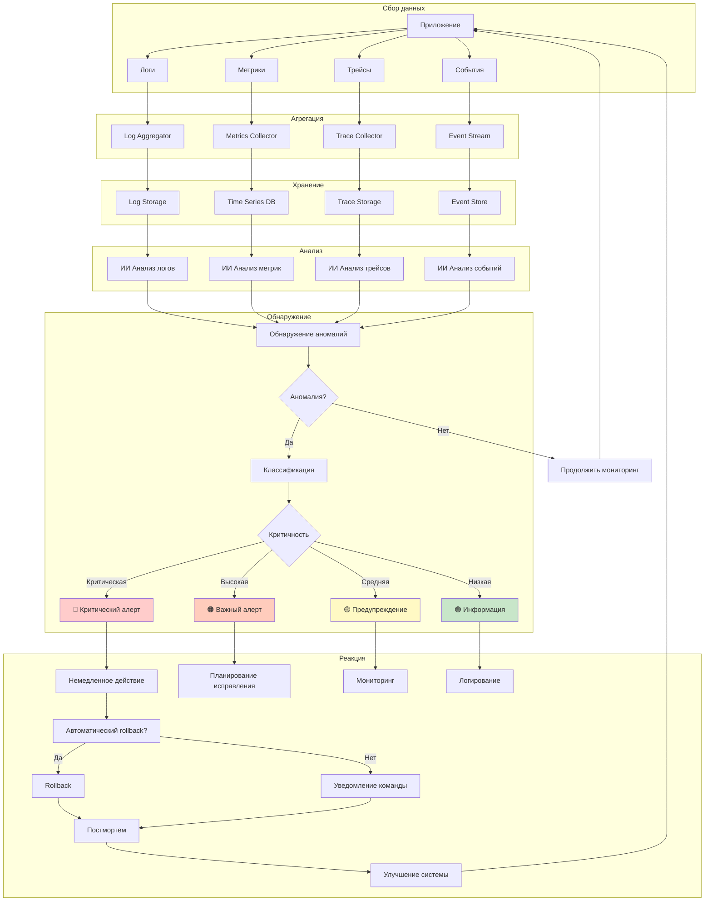
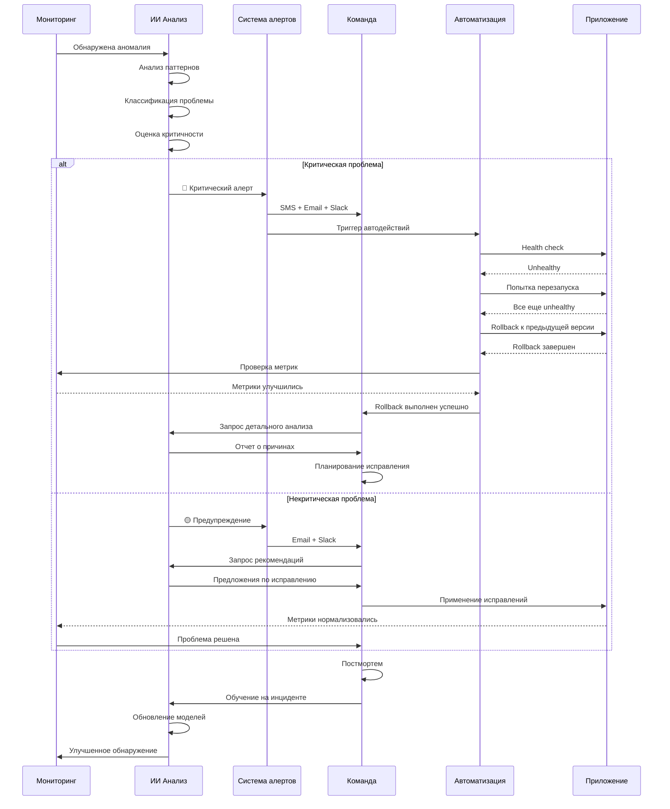

# Диаграмма 7: Развертывание и мониторинг

## Вариант A: Полный deployment pipeline

```mermaid
graph LR
    subgraph "Development"
        D1[Local Dev] --> D2[Feature Branch]
        D2 --> D3[Pull Request]
        D3 --> D4[Code Review]
        D4 --> D5[Merge to Main]
    end
    
    subgraph "Build & Test"
        D5 --> B1[CI Trigger]
        B1 --> B2[Install Dependencies]
        B2 --> B3[Build]
        B3 --> B4[Unit Tests]
        B4 --> B5[Integration Tests]
        B5 --> B6[E2E Tests]
        B6 --> B7{All Pass?}
        B7 -->|Нет| B8[Notify Team]
        B7 -->|Да| B9[Create Artifact]
    end
    
    subgraph "Staging"
        B9 --> S1[Deploy to Staging]
        S1 --> S2[Smoke Tests]
        S2 --> S3[Integration Tests]
        S3 --> S4[Performance Tests]
        S4 --> S5{Tests OK?}
        S5 -->|Нет| S6[Rollback]
        S5 -->|Да| S7[Manual QA]
        S7 --> S8{Approved?}
        S8 -->|Нет| S6
    end
    
    subgraph "Production"
        S8 -->|Да| P1[Deploy to Prod]
        P1 --> P2[Blue-Green Switch]
        P2 --> P3[Health Check]
        P3 --> P4{Healthy?}
        P4 -->|Нет| P5[Rollback]
        P4 -->|Да| P6[Monitor]
        P6 --> P7[Collect Metrics]
        P7 --> P8{Anomalies?}
        P8 -->|Да| P9[Alert Team]
        P8 -->|Нет| P10[Success]
    end
    
    B8 --> End1[❌ Failed]
    S6 --> End1
    P5 --> End1
    P9 --> End1
    P10 --> End2[✓ Deployed]
    
    style End1 fill:#ffcccb
    style End2 fill:#90ee90
```

## Вариант B: Стратегии развертывания

## Вариант C: Система мониторинга

## Вариант D: Дашборд мониторинга в реальном времени

```mermaid
graph TB
    subgraph "Системные метрики"
        S1[CPU: 45%]
        S2[Memory: 2.3GB / 8GB]
        S3[Disk: 45GB / 100GB]
        S4[Network: 125 Mbps]
        S5[Uptime: 99.98%]
    end
    
    subgraph "Метрики приложения"
        A1[Requests/sec: 1,234]
        A2[Response Time: 145ms]
        A3[Error Rate: 0.02%]
        A4[Active Users: 5,678]
        A5[DB Queries: 8,901/sec]
    end
    
    subgraph "Бизнес-метрики"
        B1[Blocks Created: 234/hour]
        B2[CRDT Operations: 1,567/min]
        B3[Search Queries: 456/min]
        B4[Plugin Loads: 89/min]
        B5[Sync Events: 2,345/min]
    end
    
    subgraph "Метрики качества"
        Q1[Apdex Score: 0.95]
        Q2[SLA Compliance: 99.9%]
        Q3[MTTR: 15 min]
        Q4[MTBF: 720 hours]
        Q5[Customer Satisfaction: 4.8/5]
    end
    
    subgraph "Алерты"
        AL1[🟢 Все системы работают]
        AL2[🟡 2 предупреждения]
        AL3[🔴 0 критических]
    end
    
    S1 --> Health[Общее здоровье]
    A1 --> Health
    B1 --> Health
    Q1 --> Health
    
    Health --> Status{Статус}
    Status -->|Отлично| ST1[🟢 Healthy]
    Status -->|Хорошо| ST2[🟡 Degraded]
    Status -->|Плохо| ST3[🔴 Critical]
    
    ST1 --> AL1
    ST2 --> AL2
    ST3 --> AL3
    
    style ST1 fill:#90ee90
    style ST2 fill:#fff9c4
    style ST3 fill:#ffcccb
```

## Вариант E: Incident Response Flow

