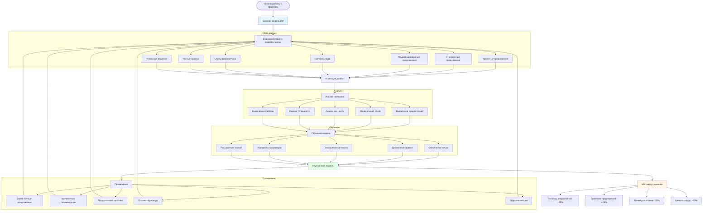
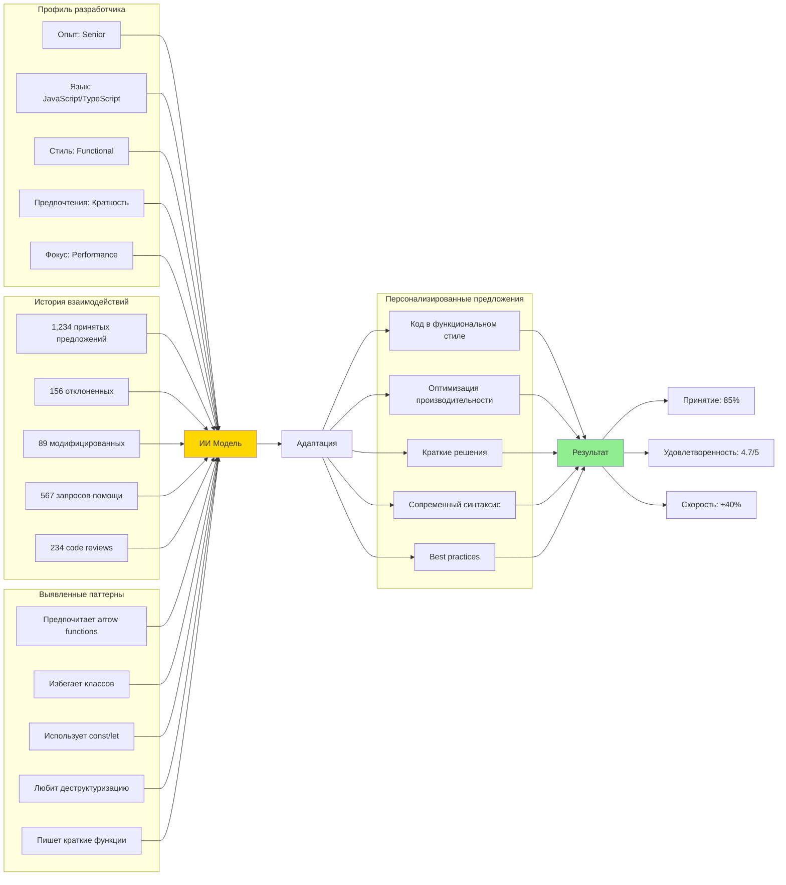
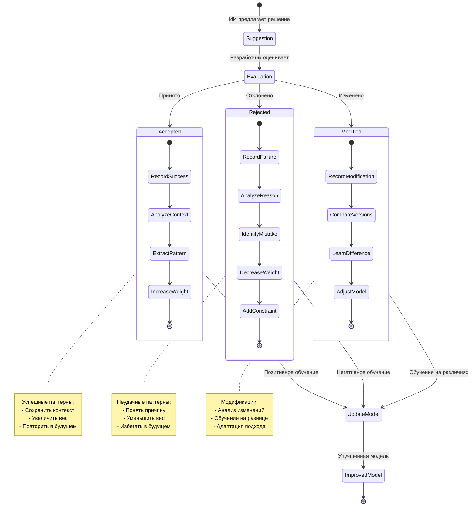
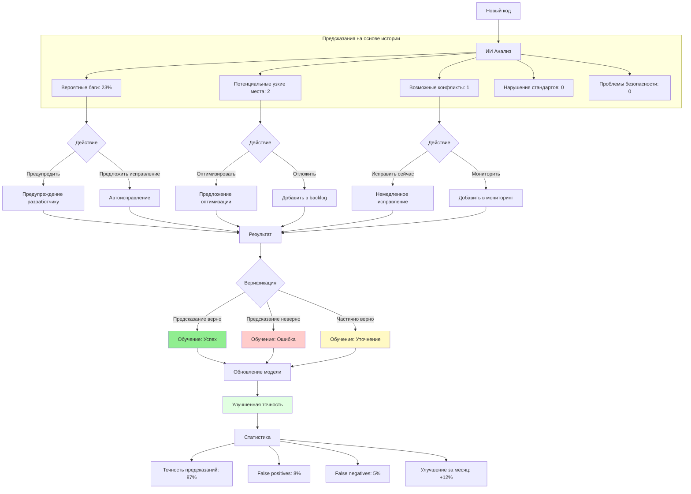
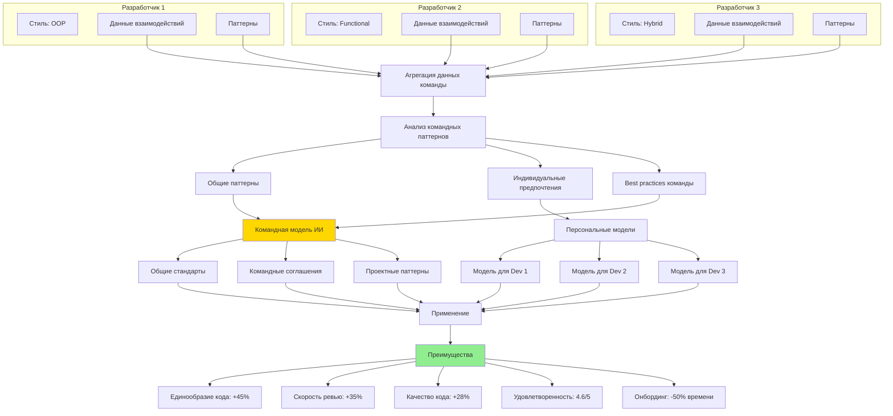

# Диаграмма 8: Обучение и адаптация ИИ

## Вариант A: Цикл обучения ИИ на проекте

## Вариант B: Персонализация ИИ под разработчика

## Вариант C: Обучение на ошибках и успехах

## Вариант D: Предиктивный анализ с обучением

## Вариант E: Коллективное обучение от команды

