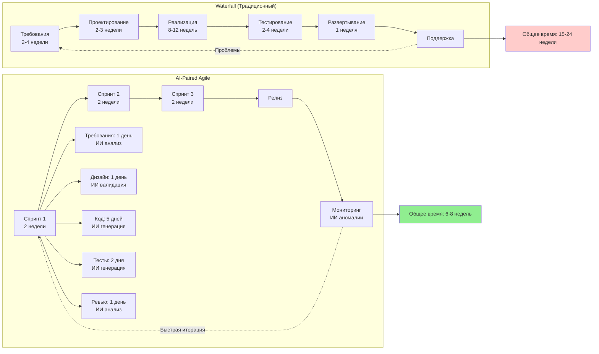
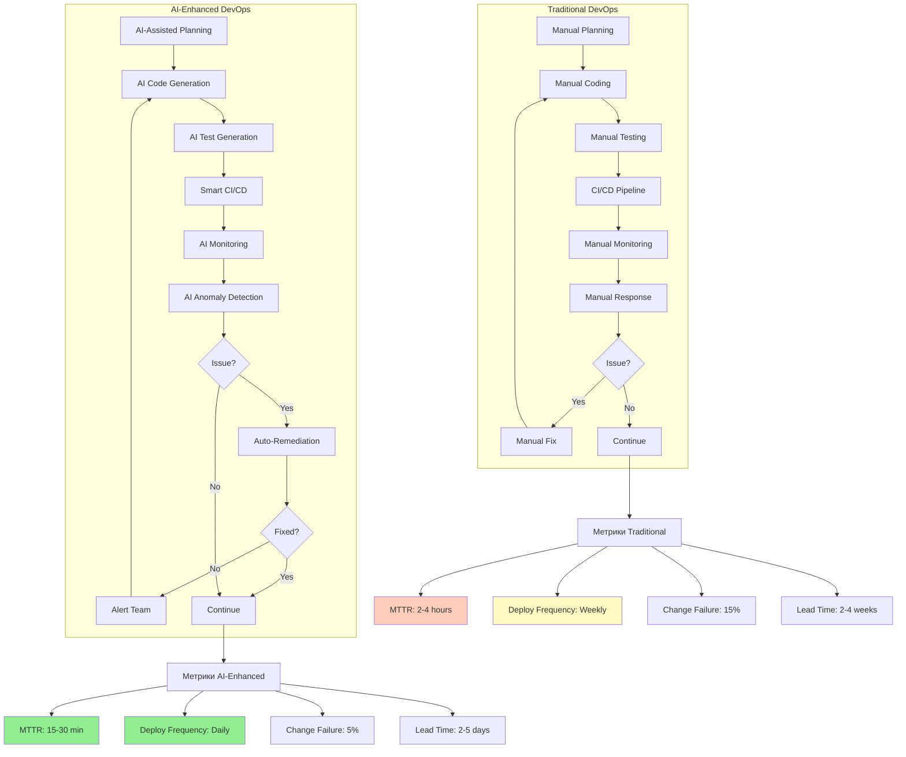
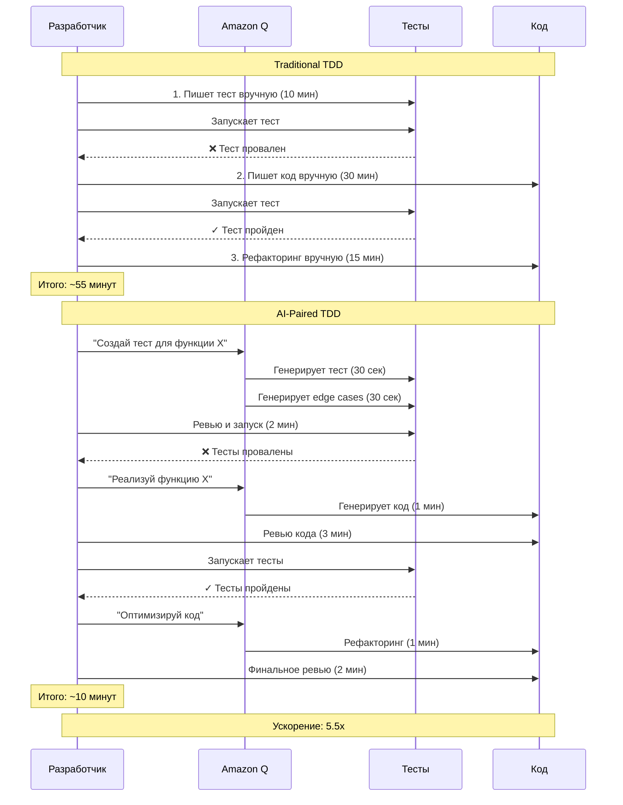

# Диаграмма 9: Сравнение методологий разработки

## Вариант A: Традиционный Waterfall vs AI-Paired Agile

## Вариант B: Сравнительная таблица методологий

```mermaid
graph TB
    subgraph "Критерии сравнения"
        C1[Скорость разработки]
        C2[Качество кода]
        C3[Гибкость]
        C4[Стоимость]
        C5[Риски]
        C6[Документация]
        C7[Тестирование]
        C8[Масштабируемость]
    end
    
    subgraph "Waterfall"
        W_C1[Медленно: 6-12 мес]
        W_C2[Среднее: 70%]
        W_C3[Низкая: Сложно менять]
        W_C4[Высокая: $$$]
        W_C5[Высокие: Поздние находки]
        W_C6[Хорошая: Но устаревает]
        W_C7[В конце: Дорого]
        W_C8[Сложная]
    end
    
    subgraph "Agile"
        A_C1[Быстро: 2-4 мес]
        A_C2[Хорошее: 80%]
        A_C3[Высокая: Итерации]
        A_C4[Средняя: $$]
        A_C5[Средние: Ранние находки]
        A_C6[Средняя: Часто устаревает]
        A_C7[Непрерывное: Дешевле]
        A_C8[Хорошая]
    end
    
    subgraph "AI-Paired Agile"
        AI_C1[Очень быстро: 1-2 мес]
        AI_C2[Отличное: 90%]
        AI_C3[Очень высокая: Реал-тайм]
        AI_C4[Низкая: $]
        AI_C5[Низкие: Предиктивные]
        AI_C6[Отличная: Автообновление]
        AI_C7[Автоматическое: Дешево]
        AI_C8[Отличная]
    end
    
    C1 --> W_C1
    C1 --> A_C1
    C1 --> AI_C1
    
    C2 --> W_C2
    C2 --> A_C2
    C2 --> AI_C2
    
    C3 --> W_C3
    C3 --> A_C3
    C3 --> AI_C3
    
    style W_C1 fill:#ffcccb
    style A_C1 fill:#fff9c4
    style AI_C1 fill:#90ee90
    
    style W_C2 fill:#fff9c4
    style A_C2 fill:#c8e6c9
    style AI_C2 fill:#90ee90
```

## Вариант C: DevOps vs AI-Enhanced DevOps

## Вариант D: TDD vs AI-Paired TDD

## Вариант E: Метрики эффективности методологий

```mermaid
graph TB
    subgraph "Waterfall Metrics"
        WM1[Time to Market: 12 месяцев]
        WM2[Bug Density: 15 bugs/KLOC]
        WM3[Code Coverage: 60%]
        WM4[Team Velocity: 20 SP/sprint]
        WM5[Customer Satisfaction: 3.2/5]
        WM6[Technical Debt: High]
        WM7[Documentation: 85%]
        WM8[Deployment Success: 75%]
    end
    
    subgraph "Agile Metrics"
        AM1[Time to Market: 4 месяца]
        AM2[Bug Density: 8 bugs/KLOC]
        AM3[Code Coverage: 75%]
        AM4[Team Velocity: 35 SP/sprint]
        AM5[Customer Satisfaction: 4.1/5]
        AM6[Technical Debt: Medium]
        AM7[Documentation: 65%]
        AM8[Deployment Success: 85%]
    end
    
    subgraph "AI-Paired Agile Metrics"
        AIM1[Time to Market: 1.5 месяца]
        AIM2[Bug Density: 3 bugs/KLOC]
        AIM3[Code Coverage: 88%]
        AIM4[Team Velocity: 65 SP/sprint]
        AIM5[Customer Satisfaction: 4.7/5]
        AIM6[Technical Debt: Low]
        AIM7[Documentation: 92%]
        AIM8[Deployment Success: 95%]
    end
    
    WM1 --> Compare[Сравнение]
    AM1 --> Compare
    AIM1 --> Compare
    
    WM2 --> Compare
    AM2 --> Compare
    AIM2 --> Compare
    
    WM3 --> Compare
    AM3 --> Compare
    AIM3 --> Compare
    
    Compare --> Winner[Победитель: AI-Paired Agile]
    
    Winner --> Improvements[Улучшения]
    Improvements --> I1[Скорость: +62% vs Agile]
    Improvements --> I2[Качество: +37% vs Agile]
    Improvements --> I3[Покрытие: +17% vs Agile]
    Improvements --> I4[Velocity: +86% vs Agile]
    Improvements --> I5[Satisfaction: +15% vs Agile]
    
    style Winner fill:#ffd700
    style Improvements fill:#90ee90
    style AIM1 fill:#90ee90
    style AIM2 fill:#90ee90
    style AIM3 fill:#90ee90
    style AIM4 fill:#90ee90
    style AIM5 fill:#90ee90
```

