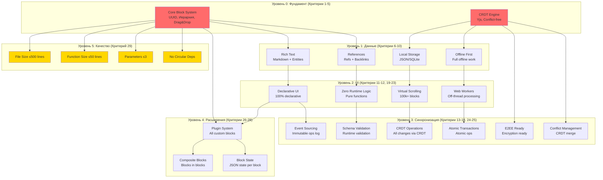
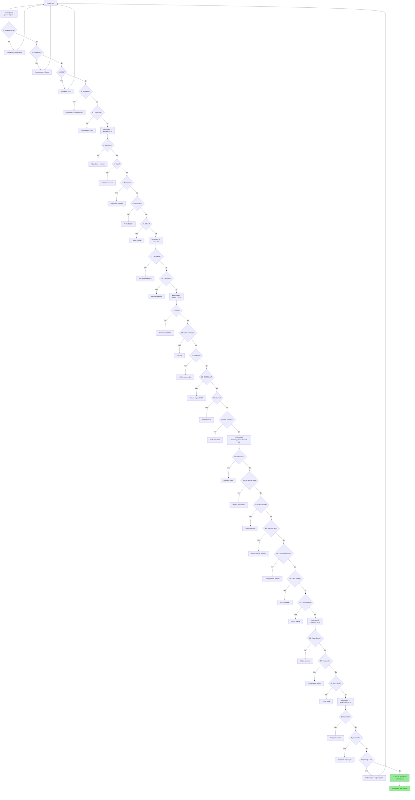
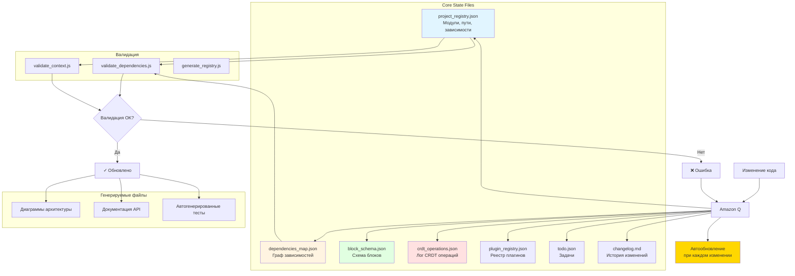

# Диаграмма 10: Специфика проекта PromAi PKM

## Вариант A: Архитектура модулей PromAi



## Вариант B: Валидация 29 критериев



## Вариант C: Блочная система в деталях

```mermaid
graph TB
    subgraph "Block Structure"
        B[Block]
        B --> B_ID[id: UUID v4/v7]
        B --> B_Type[type: string]
        B --> B_Content[content: any]
        B --> B_Children[children: UUID[]]
        B --> B_Parent[parent?: UUID]
        B --> B_Refs[refs: UUID[]]
        B --> B_Backlinks[backlinks: UUID[]]
        B --> B_Props[properties: Object]
        B --> B_Created[created: timestamp]
        B --> B_Modified[modified: timestamp]
    end
    
    subgraph "CRDT Operations"
        Op[Operation]
        Op --> Op_ID[id: UUID]
        Op --> Op_Type[type: create|update|delete|move]
        Op --> Op_Block[blockId: UUID]
        Op --> Op_Data[data: any]
        Op --> Op_Time[timestamp: number]
        Op --> Op_User[userId: string]
    end
    
    subgraph "Plugin Block"
        PB[Plugin Block]
        PB --> PB_ID[id: UUID]
        PB --> PB_Plugin[pluginId: string]
        PB --> PB_State[state: JSON]
        PB --> PB_Children[children: Block[]]
        PB --> PB_Render[render(): HTMLElement]
    end
    
    subgraph "Storage"
        S[Storage Layer]
        S --> S_JSON[JSON: Human readable]
        S --> S_SQLite[SQLite: Fast queries]
        S --> S_Index[Index: Search]
        S --> S_Log[Ops Log: Event sourcing]
    end
    
    B --> Op
    Op --> S
    PB --> B
    S --> Sync[Cross-device Sync]
    
    style B fill:#e1f5ff
    style Op fill:#fff4e1
    style PB fill:#e1ffe1
    style S fill:#ffe1e1
```

## Вариант D: Performance targets для 100k+ блоков

```mermaid
graph TB
    subgraph "Startup Performance"
        SP1[Load 10k blocks: <2 sec]
        SP2[Load 50k blocks: <5 sec]
        SP3[Load 100k blocks: <10 sec]
        SP4[Initial render: <1 sec]
    end
    
    subgraph "Runtime Performance"
        RP1[Search 100k blocks: <100ms]
        RP2[Scroll 60 FPS: Always]
        RP3[CRDT operation: <10ms]
        RP4[Block create: <5ms]
        RP5[Block update: <5ms]
    end
    
    subgraph "Memory Performance"
        MP1[10k blocks: <100MB]
        MP2[50k blocks: <500MB]
        MP3[100k blocks: <1GB]
        MP4[Virtual scroll: Constant]
    end
    
    subgraph "Storage Performance"
        STP1[Save block: <50ms]
        STP2[Load block: <10ms]
        STP3[Create snapshot: <500ms]
        STP4[Load database: <1s]
    end
    
    subgraph "Optimization Techniques"
        OT1[Virtual Scrolling]
        OT2[Lazy Loading]
        OT3[Web Workers]
        OT4[IndexedDB Cache]
        OT5[Debounced Save]
        OT6[Memoization]
    end
    
    SP1 --> OT1
    SP2 --> OT2
    RP1 --> OT3
    RP2 --> OT1
    MP1 --> OT1
    MP2 --> OT2
    STP1 --> OT5
    STP2 --> OT4
    
    OT1 --> Target[Target: 100k+ blocks<br/>smooth performance]
    OT2 --> Target
    OT3 --> Target
    OT4 --> Target
    OT5 --> Target
    OT6 --> Target
    
    style Target fill:#90ee90
```



## Вариант E: State файлы и их взаимосвязи


