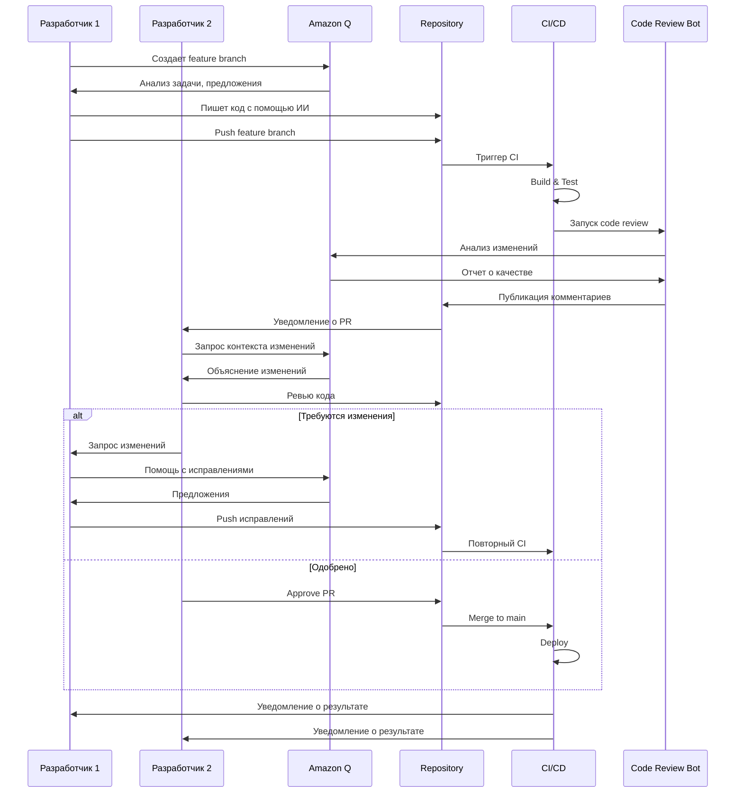
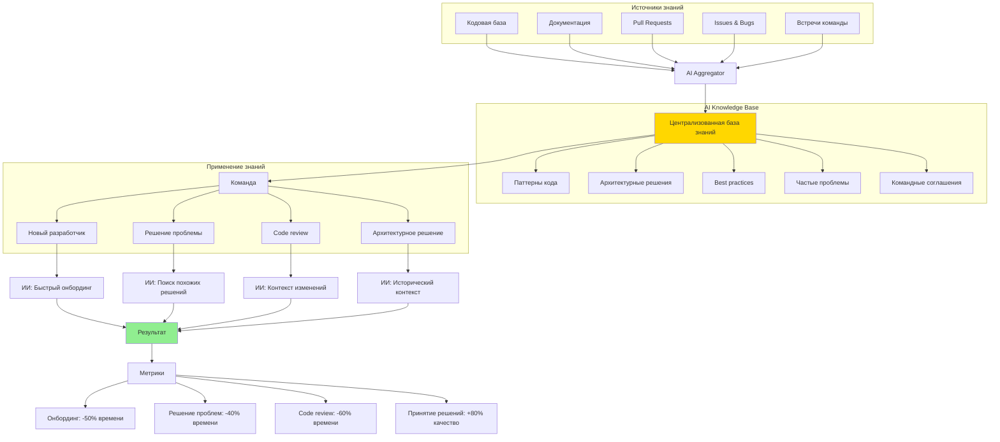
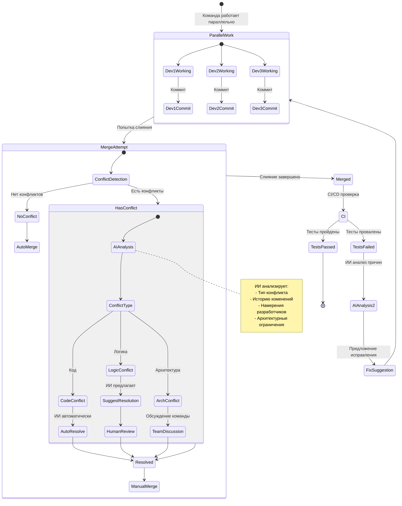

# Диаграмма 11: Командная работа и коллаборация

## Вариант A: Workflow командной разработки с ИИ

## Вариант B: Распределение ролей в команде с ИИ

```mermaid
graph TB
    subgraph "Product Owner"
        PO[Product Owner]
        PO --> PO1[Определяет требования]
        PO --> PO2[Приоритизирует backlog]
        PO --> PO3[Принимает результаты]
    end
    
    subgraph "Tech Lead + AI"
        TL[Tech Lead]
        TL --> TL1[Архитектурные решения]
        TL --> TL2[Code review]
        TL --> TL3[Менторинг команды]
        
        AI_TL[AI Assistant]
        AI_TL --> AI_TL1[Валидация архитектуры]
        AI_TL --> AI_TL2[Автоматический review]
        AI_TL --> AI_TL3[Предложения best practices]
    end
    
    subgraph "Developers + AI"
        Dev[Developers]
        Dev --> Dev1[Реализация функций]
        Dev --> Dev2[Написание тестов]
        Dev --> Dev3[Документация]
        
        AI_Dev[AI Pair Programmer]
        AI_Dev --> AI_Dev1[Генерация кода]
        AI_Dev --> AI_Dev2[Генерация тестов]
        AI_Dev --> AI_Dev3[Автодокументация]
    end
    
    subgraph "QA + AI"
        QA[QA Engineer]
        QA --> QA1[Тест-планы]
        QA --> QA2[Ручное тестирование]
        QA --> QA3[Баг-репорты]
        
        AI_QA[AI Test Assistant]
        AI_QA --> AI_QA1[Генерация тест-кейсов]
        AI_QA --> AI_QA2[Автоматизация тестов]
        AI_QA --> AI_QA3[Анализ багов]
    end
    
    subgraph "DevOps + AI"
        DO[DevOps]
        DO --> DO1[CI/CD настройка]
        DO --> DO2[Мониторинг]
        DO --> DO3[Инфраструктура]
        
        AI_DO[AI Ops Assistant]
        AI_DO --> AI_DO1[Оптимизация pipeline]
        AI_DO --> AI_DO2[Предиктивные алерты]
        AI_DO --> AI_DO3[Auto-scaling]
    end
    
    PO1 --> TL1
    TL1 --> Dev1
    Dev1 --> QA1
    QA1 --> DO1
    
    AI_TL1 --> TL1
    AI_Dev1 --> Dev1
    AI_QA1 --> QA1
    AI_DO1 --> DO1
    
    style AI_TL fill:#ffd700
    style AI_Dev fill:#ffd700
    style AI_QA fill:#ffd700
    style AI_DO fill:#ffd700
```

## Вариант C: Синхронизация знаний в команде

## Вариант D: Conflict resolution в команде

## Вариант E: Метрики командной эффективности

```mermaid
graph TB
    subgraph "Без ИИ (Baseline)"
        B1[Velocity: 30 SP/sprint]
        B2[Code Review: 4 hours]
        B3[Bug Fix Time: 8 hours]
        B4[Onboarding: 4 weeks]
        B5[Documentation: 60%]
        B6[Team Satisfaction: 3.5/5]
        B7[Knowledge Sharing: Manual]
        B8[Context Switching: High]
    end
    
    subgraph "С ИИ (Current)"
        C1[Velocity: 65 SP/sprint]
        C2[Code Review: 1.5 hours]
        C3[Bug Fix Time: 3 hours]
        C4[Onboarding: 2 weeks]
        C5[Documentation: 92%]
        C6[Team Satisfaction: 4.6/5]
        C7[Knowledge Sharing: Automated]
        C8[Context Switching: Low]
    end
    
    B1 --> Improvement[Улучшения]
    C1 --> Improvement
    B2 --> Improvement
    C2 --> Improvement
    B3 --> Improvement
    C3 --> Improvement
    B4 --> Improvement
    C4 --> Improvement
    
    Improvement --> Results[Результаты]
    
    Results --> R1[Velocity: +117%]
    Results --> R2[Review Time: -62%]
    Results --> R3[Bug Fix: -62%]
    Results --> R4[Onboarding: -50%]
    Results --> R5[Docs: +53%]
    Results --> R6[Satisfaction: +31%]
    Results --> R7[Knowledge: Автоматизировано]
    Results --> R8[Context: Минимизировано]
    
    Results --> ROI[ROI Analysis]
    ROI --> ROI1[Экономия времени: 40%]
    ROI --> ROI2[Качество кода: +35%]
    ROI --> ROI3[Удержание команды: +25%]
    ROI --> ROI4[Time to Market: -45%]
    
    style Results fill:#90ee90
    style ROI fill:#ffd700
```

