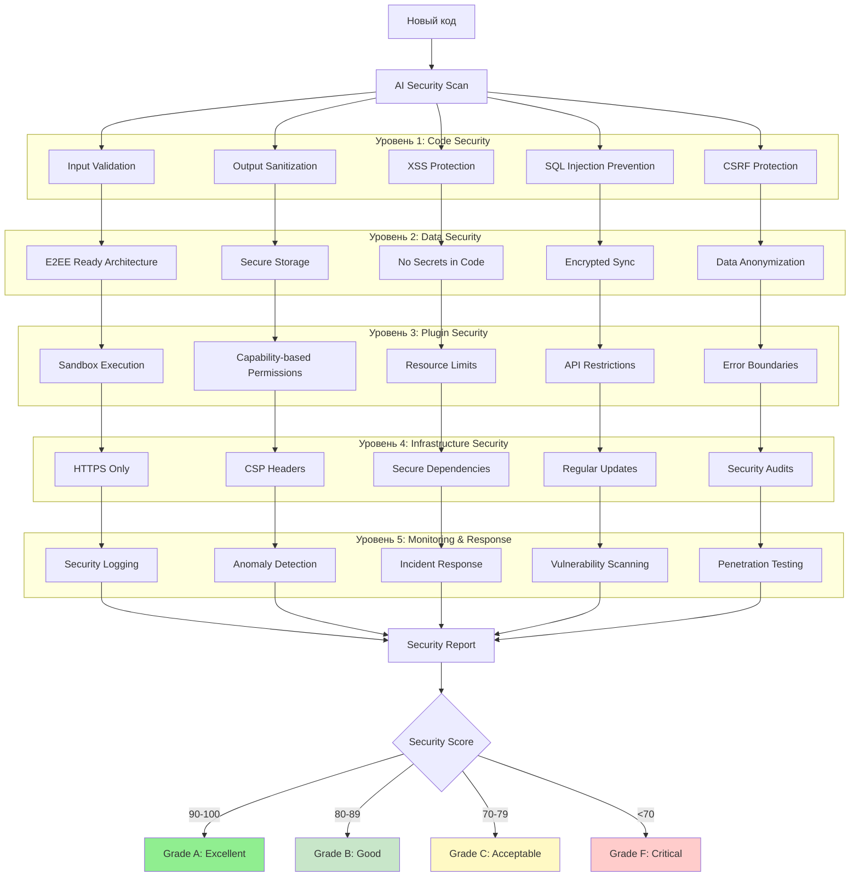
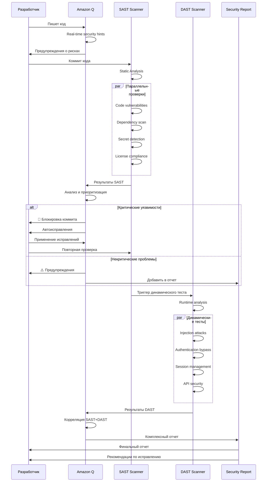
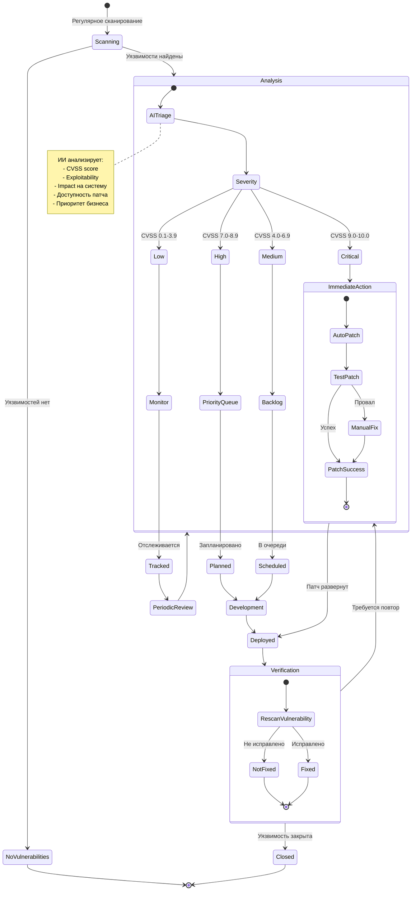
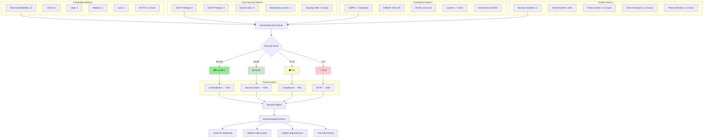

# Диаграмма 12: Безопасность и соответствие стандартам

## Вариант A: Многоуровневая безопасность



## Вариант B: SAST/DAST процесс с ИИ



## Вариант C: Compliance checklist

```mermaid
graph TD
    Start[Проверка соответствия] --> GDPR[GDPR Compliance]
    
    subgraph "GDPR Requirements"
        GDPR --> G1{Data Minimization?}
        G1 -->|Нет| Fix_G1[Минимизировать данные]
        G1 -->|Да| G2{User Consent?}
        G2 -->|Нет| Fix_G2[Добавить consent]
        G2 -->|Да| G3{Right to Delete?}
        G3 -->|Нет| Fix_G3[Реализовать удаление]
        G3 -->|Да| G4{Data Portability?}
        G4 -->|Нет| Fix_G4[Экспорт данных]
        G4 -->|Да| G5{Privacy by Design?}
        G5 -->|Нет| Fix_G5[Пересмотр архитектуры]
        G5 -->|Да| GDPR_OK[✓ GDPR OK]
    end
    
    GDPR_OK --> OWASP[OWASP Top 10]
    
    subgraph "OWASP Checks"
        OWASP --> O1{Injection?}
        O1 -->|Найдено| Fix_O1[Исправить injection]
        O1 -->|OK| O2{Broken Auth?}
        O2 -->|Найдено| Fix_O2[Усилить auth]
        O2 -->|OK| O3{Sensitive Data?}
        O3 -->|Найдено| Fix_O3[Защитить данные]
        O3 -->|OK| O4{XXE?}
        O4 -->|Найдено| Fix_O4[Отключить XXE]
        O4 -->|OK| O5{Broken Access?}
        O5 -->|Найдено| Fix_O5[Исправить доступ]
        O5 -->|OK| OWASP_OK[✓ OWASP OK]
    end
    
    OWASP_OK --> Accessibility[Accessibility (WCAG)]
    
    subgraph "WCAG 2.1 AA"
        Accessibility --> A1{Perceivable?}
        A1 -->|Нет| Fix_A1[Alt text, captions]
        A1 -->|Да| A2{Operable?}
        A2 -->|Нет| Fix_A2[Keyboard navigation]
        A2 -->|Да| A3{Understandable?}
        A3 -->|Нет| Fix_A3[Clear language]
        A3 -->|Да| A4{Robust?}
        A4 -->|Нет| Fix_A4[Semantic HTML]
        A4 -->|Да| WCAG_OK[✓ WCAG OK]
    end
    
    WCAG_OK --> License[License Compliance]
    
    subgraph "License Checks"
        License --> L1{Dependencies OK?}
        L1 -->|Нет| Fix_L1[Заменить зависимости]
        L1 -->|Да| L2{License conflicts?}
        L2 -->|Да| Fix_L2[Разрешить конфликты]
        L2 -->|Нет| L3{Attribution?}
        L3 -->|Нет| Fix_L3[Добавить attribution]
        L3 -->|Да| License_OK[✓ License OK]
    end
    
    License_OK --> Final[✓ Все проверки пройдены]
    
    Fix_G1 --> Start
    Fix_O1 --> Start
    Fix_A1 --> Start
    Fix_L1 --> Start
    
    style Final fill:#90ee90
```

## Вариант D: Vulnerability management workflow



## Вариант E: Security metrics dashboard


