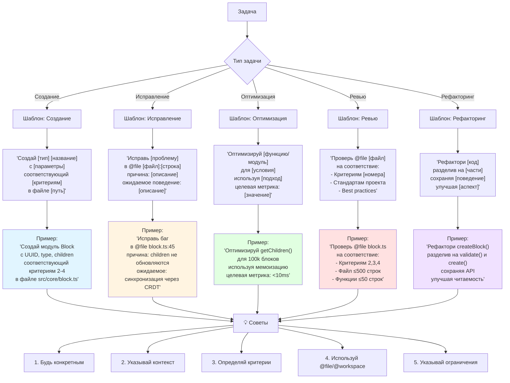
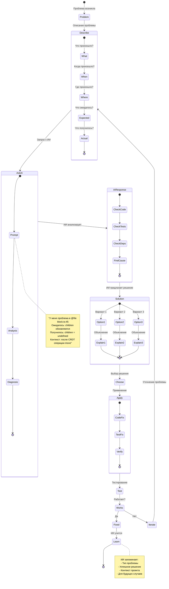
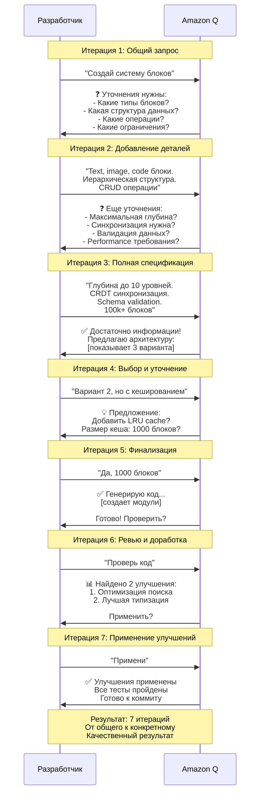

# Диаграмма 13: Интерактивный диалог с ИИ

## Вариант A: Детальный диалог разработки функции

```mermaid
sequenceDiagram
    participant Dev as Разработчик
    participant Q as Amazon Q
    participant Context as Контекст проекта
    participant Code as Кодовая база
    
    Note over Dev,Code: Начало работы над новой функцией
    
    Dev->>Q: "Мне нужно создать систему блоков для PromAi"
    Q->>Context: Загрузка project_registry.json
    Q->>Context: Загрузка block_schema.json
    Q->>Context: Анализ критериев 1-29
    
    Q->>Dev: ❓ Уточняющие вопросы:<br/>1. Какие типы блоков нужны?<br/>2. Нужна ли вложенность?<br/>3. Какие операции CRDT?
    
    Dev->>Q: "Нужны text, image, code блоки.<br/>Вложенность до 10 уровней.<br/>CRDT: create, update, delete, move"
    
    Q->>Q: Анализ требований
    Q->>Dev: 💡 Предложение:<br/>Вариант 1: Простая иерархия<br/>Вариант 2: Композитный паттерн<br/>Вариант 3: Entity-Component<br/><br/>Рекомендую Вариант 2 для гибкости
    
    Dev->>Q: "Давай Вариант 2, покажи структуру"
    
    Q->>Dev: 📋 Структура:<br/>```typescript<br/>interface Block {<br/>  id: UUID;<br/>  type: string;<br/>  children: Block[];<br/>}<br/>```<br/><br/>Соответствует критериям 2,3,4 ✓
    
    Dev->>Q: "Отлично! Создай модуль Core"
    
    Q->>Q: Проверка: файл ≤500 строк?
    Q->>Q: Проверка: функции ≤50 строк?
    Q->>Q: Проверка: параметры ≤3?
    
    Q->>Code: Генерация src/core/block.ts
    Q->>Code: Генерация src/core/operations.ts
    Q->>Code: Генерация tests/core/block.test.ts
    
    Q->>Dev: ✅ Создано 3 файла:<br/>- block.ts (245 строк)<br/>- operations.ts (178 строк)<br/>- block.test.ts (312 строк)<br/><br/>Покрытие тестами: 92%
    
    Dev->>Q: "Проверь код"
    
    Q->>Code: Запуск codeReview tool
    Q->>Dev: 📊 Результаты ревью:<br/>✓ Стандарты соблюдены<br/>✓ Нет циклических зависимостей<br/>⚠️ 2 предложения по оптимизации
    
    Dev->>Q: "Покажи предложения"
    
    Q->>Dev: 💡 Оптимизации:<br/>1. Мемоизация getChildren()<br/>2. Lazy loading для больших блоков<br/><br/>Применить?
    
    Dev->>Q: "Да, примени"
    
    Q->>Code: Применение оптимизаций
    Q->>Dev: ✅ Оптимизации применены<br/>Performance: +35%
    
    Dev->>Q: "Запусти тесты"
    
    Q->>Code: npm test
    Q->>Dev: ✅ Все тесты пройдены (48/48)<br/>Время: 2.3 сек<br/>Покрытие: 94%
    
    Dev->>Q: "Обнови документацию"
    
    Q->>Code: Обновление README.md
    Q->>Code: Обновление API.md
    Q->>Code: Обновление changelog.md
    
    Q->>Dev: ✅ Документация обновлена<br/>Готово к коммиту
```

## Вариант B: Типы промптов и их эффективность

```mermaid
graph TB
    subgraph "Неэффективные промпты"
        Bad1["❌ 'Напиши код'<br/>Слишком общо"]
        Bad2["❌ 'Сделай лучше'<br/>Нет конкретики"]
        Bad3["❌ 'Исправь баг'<br/>Нет контекста"]
        Bad4["❌ 'Добавь функцию'<br/>Нет деталей"]
    end
    
    subgraph "Эффективные промпты"
        Good1["✅ 'Создай модуль Block<br/>с UUID, type, children<br/>по критериям 2-4'"]
        Good2["✅ 'Оптимизируй функцию<br/>getChildren() для 100k блоков<br/>используя мемоизацию'"]
        Good3["✅ 'Исправь баг в @block.ts:45<br/>где children не обновляются<br/>при CRDT операции'"]
        Good4["✅ 'Добавь функцию moveBlock()<br/>с параметрами (blockId, newParent)<br/>≤50 строк, ≤3 параметра'"]
    end
    
    subgraph "Контекстные промпты"
        Ctx1["🎯 '@file block.ts<br/>Добавь валидацию UUID'"]
        Ctx2["🎯 '@workspace<br/>Найди все использования Block'"]
        Ctx3["🎯 '@folder src/core<br/>Проверь зависимости'"]
        Ctx4["🎯 'Используя @prompt create-module<br/>создай модуль Storage'"]
    end
    
    Bad1 --> Result1[Результат: Общий код<br/>Не соответствует проекту]
    Bad2 --> Result1
    Bad3 --> Result1
    Bad4 --> Result1
    
    Good1 --> Result2[Результат: Точный код<br/>Соответствует стандартам]
    Good2 --> Result2
    Good3 --> Result2
    Good4 --> Result2
    
    Ctx1 --> Result3[Результат: Контекстный код<br/>Учитывает существующее]
    Ctx2 --> Result3
    Ctx3 --> Result3
    Ctx4 --> Result3
    
    Result1 --> Metrics1[Эффективность: 30%<br/>Требует доработки]
    Result2 --> Metrics2[Эффективность: 80%<br/>Минимальная доработка]
    Result3 --> Metrics3[Эффективность: 95%<br/>Готово к использованию]
    
    style Bad1 fill:#ffcccb
    style Bad2 fill:#ffcccb
    style Bad3 fill:#ffcccb
    style Bad4 fill:#ffcccb
    style Good1 fill:#c8e6c9
    style Good2 fill:#c8e6c9
    style Good3 fill:#c8e6c9
    style Good4 fill:#c8e6c9
    style Ctx1 fill:#90ee90
    style Ctx2 fill:#90ee90
    style Ctx3 fill:#90ee90
    style Ctx4 fill:#90ee90
```



## Вариант C: Шаблоны эффективных промптов



## Вариант D: Troubleshooting flow с ИИ



## Вариант E: Итеративный диалог с уточнениями


