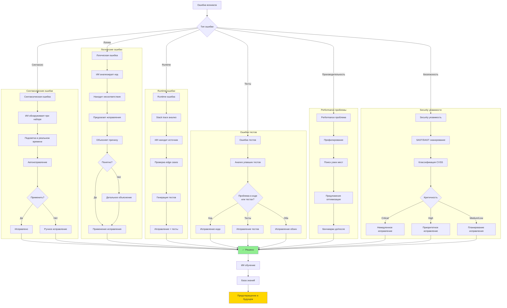
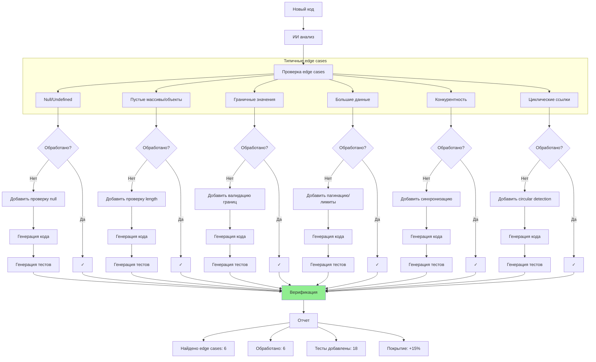
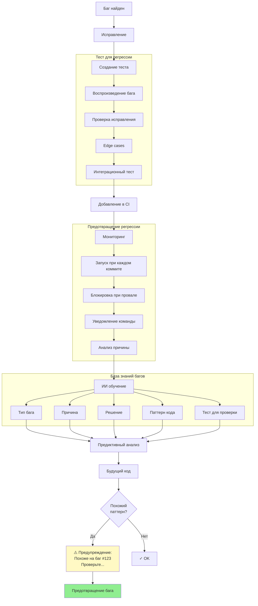
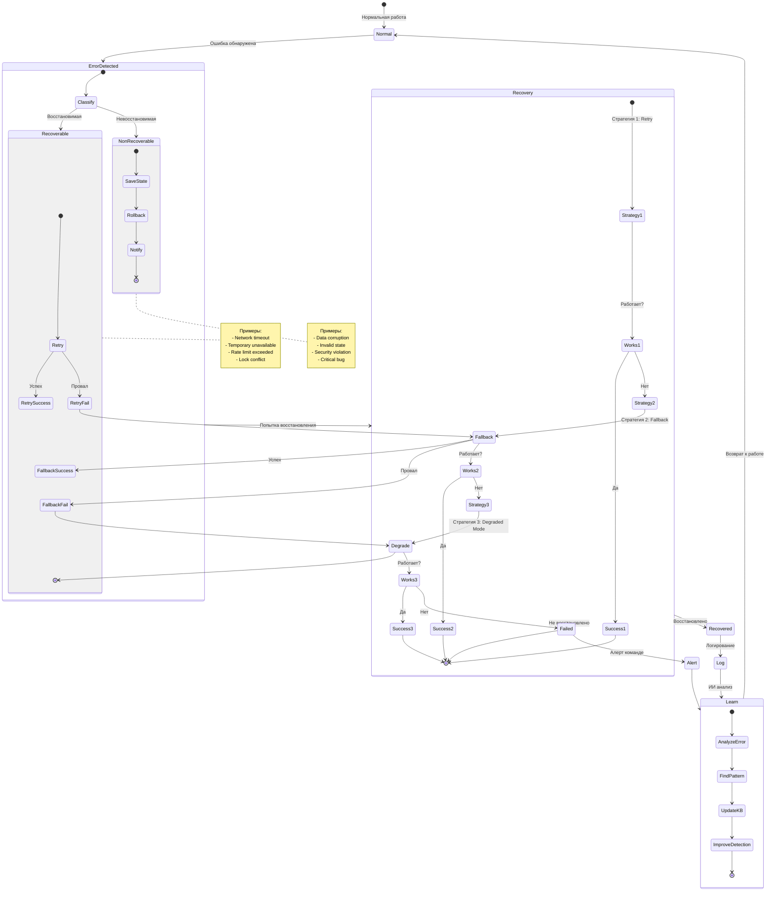

# Диаграмма 14: Обработка ошибок и edge cases

## Вариант A: Типы ошибок и их обработка



## Вариант B: Edge cases detection и handling



## Вариант C: Debugging workflow с ИИ

```mermaid
sequenceDiagram
    participant Dev as Разработчик
    participant AI as Amazon Q
    participant Debugger as Debugger
    participant Code as Код
    participant Tests as Тесты
    
    Dev->>AI: "Баг: children не обновляются"
    AI->>Dev: ❓ Уточнения:<br/>1. Когда происходит?<br/>2. Какие данные?<br/>3. Ожидаемое поведение?
    
    Dev->>AI: "При CRDT move операции<br/>blockId='abc', newParent='xyz'<br/>Ожидается: children обновлены"
    
    AI->>Code: Анализ кода
    AI->>Code: Поиск функции move()
    AI->>Code: Анализ CRDT операций
    
    AI->>Dev: 🔍 Найдено:<br/>В block.ts:45<br/>children обновляются до CRDT apply<br/>Нужно: после CRDT apply
    
    Dev->>AI: "Покажи код"
    
    AI->>Dev: ```typescript<br/>// Текущий код (неправильно)<br/>this.children = newChildren;<br/>await crdt.apply(op);<br/><br/>// Должно быть<br/>await crdt.apply(op);<br/>this.children = newChildren;<br/>```
    
    Dev->>AI: "Исправь"
    
    AI->>Code: Исправление порядка операций
    AI->>Tests: Добавление теста для этого случая
    
    AI->>Dev: ✅ Исправлено<br/>Добавлен тест: move_updates_children_after_crdt
    
    Dev->>AI: "Запусти тесты"
    
    AI->>Tests: npm test
    Tests-->>AI: ✅ Все тесты пройдены
    
    AI->>Dev: ✅ Баг исправлен<br/>Тесты: 49/49 пройдено<br/>Новый тест предотвращает регрессию
    
    Dev->>AI: "Есть ли похожие проблемы?"
    
    AI->>Code: Поиск похожих паттернов
    AI->>Dev: 🔍 Найдено 2 похожих места:<br/>1. delete() - та же проблема<br/>2. update() - правильно<br/><br/>Исправить delete()?
    
    Dev->>AI: "Да"
    
    AI->>Code: Исправление delete()
    AI->>Tests: Добавление теста
    AI->>Dev: ✅ Проактивно исправлено<br/>Предотвращен будущий баг
```

## Вариант D: Regression prevention



## Вариант E: Error recovery strategies


