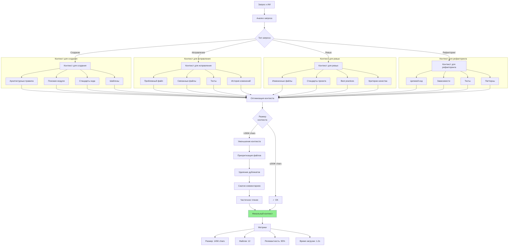
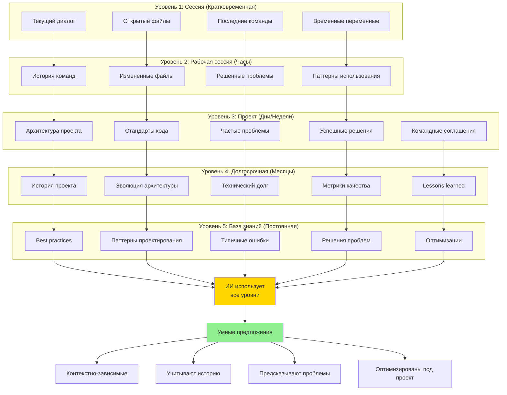
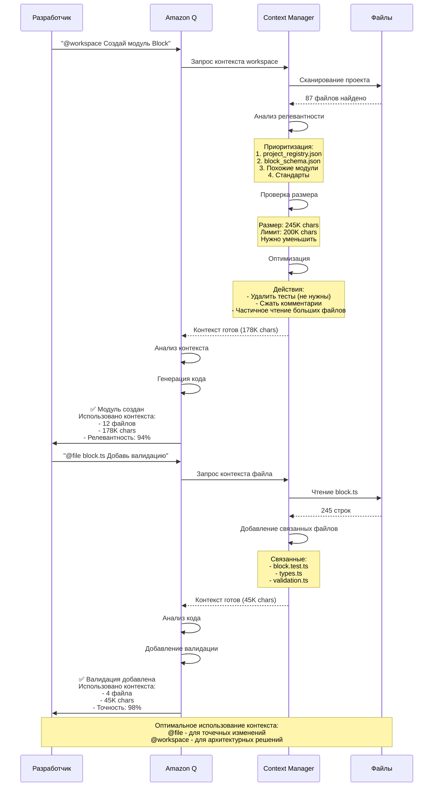
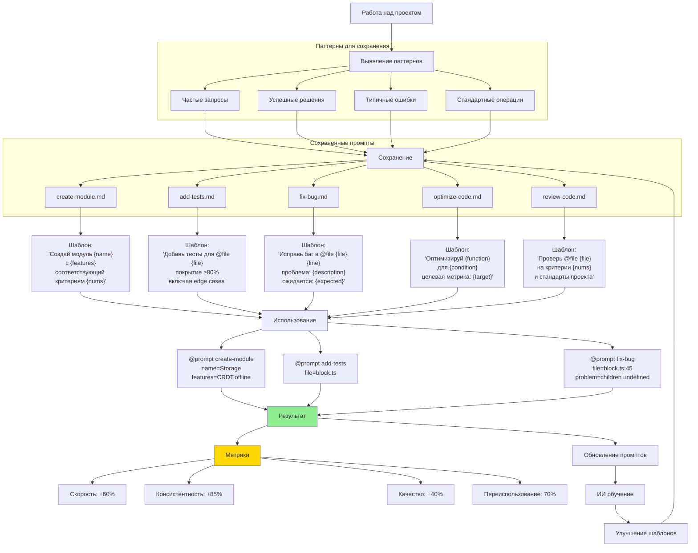

# Диаграмма 15: Контекст и память проекта

## Вариант A: Управление контекстом проекта

```mermaid
graph TB
    subgraph "Источники контекста"
        S1[@file - Конкретный файл]
        S2[@folder - Папка с файлами]
        S3[@workspace - Весь проект]
        S4[@prompt - Сохраненный промпт]
        S5[Rules - Правила проекта]
        S6[State Files - Состояние]
    end
    
    subgraph "Загрузка контекста"
        S1 --> L1[Чтение файла]
        S2 --> L2[Чтение всех файлов в папке]
        S3 --> L3[Анализ структуры проекта]
        S4 --> L4[Загрузка промпта]
        S5 --> L5[Загрузка правил]
        S6 --> L6[Загрузка state]
    end
    
    subgraph "Обработка контекста"
        L1 --> P1[Парсинг кода]
        L2 --> P2[Индексация файлов]
        L3 --> P3[Граф зависимостей]
        L4 --> P4[Шаблон промпта]
        L5 --> P5[Валидация правил]
        L6 --> P6[Текущее состояние]
    end
    
    P1 --> AI[Amazon Q Context]
    P2 --> AI
    P3 --> AI
    P4 --> AI
    P5 --> AI
    P6 --> AI
    
    AI --> Memory[Память проекта]
    
    subgraph "Память проекта"
        Memory --> M1[Архитектура]
        Memory --> M2[Стандарты]
        Memory --> M3[Паттерны кода]
        Memory --> M4[История изменений]
        Memory --> M5[Частые проблемы]
        Memory --> M6[Решения]
    end
    
    M1 --> Use[Использование]
    M2 --> Use
    M3 --> Use
    M4 --> Use
    M5 --> Use
    M6 --> Use
    
    Use --> U1[Генерация кода]
    Use --> U2[Code review]
    Use --> U3[Рефакторинг]
    Use --> U4[Troubleshooting]
    Use --> U5[Документация]
    
    style AI fill:#ffd700
    style Memory fill:#e1f5ff
```

## Вариант B: Оптимизация контекста для ИИ



## Вариант C: Иерархия памяти проекта



## Вариант D: Context window management



## Вариант E: Сохранение и переиспользование контекста


